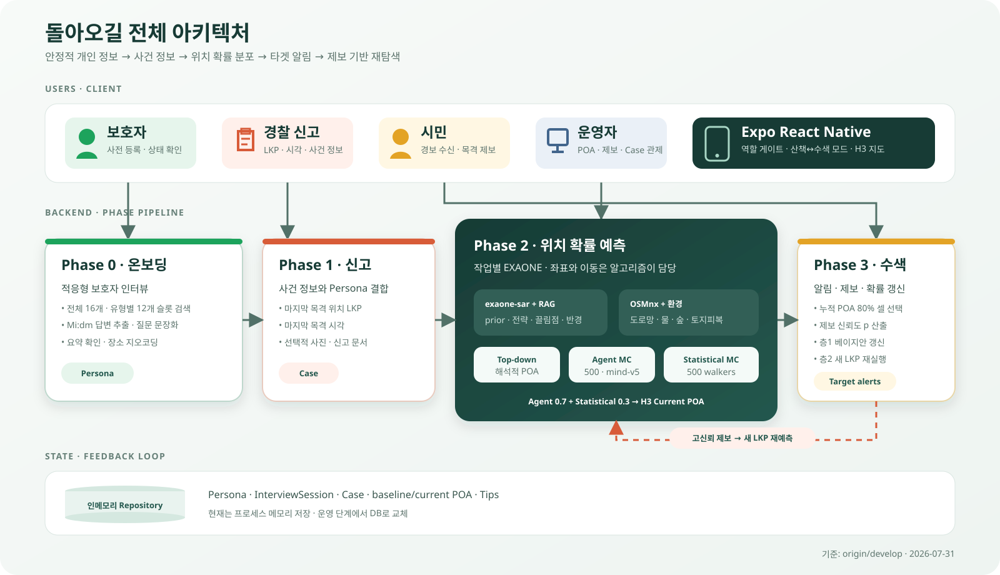
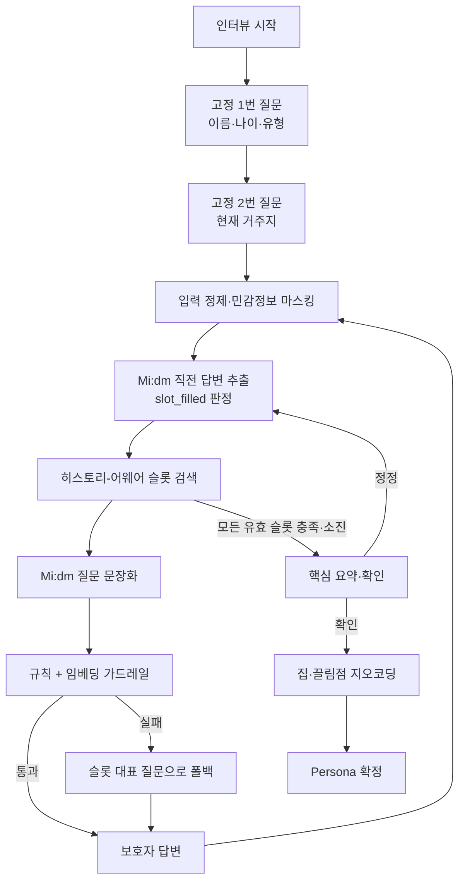
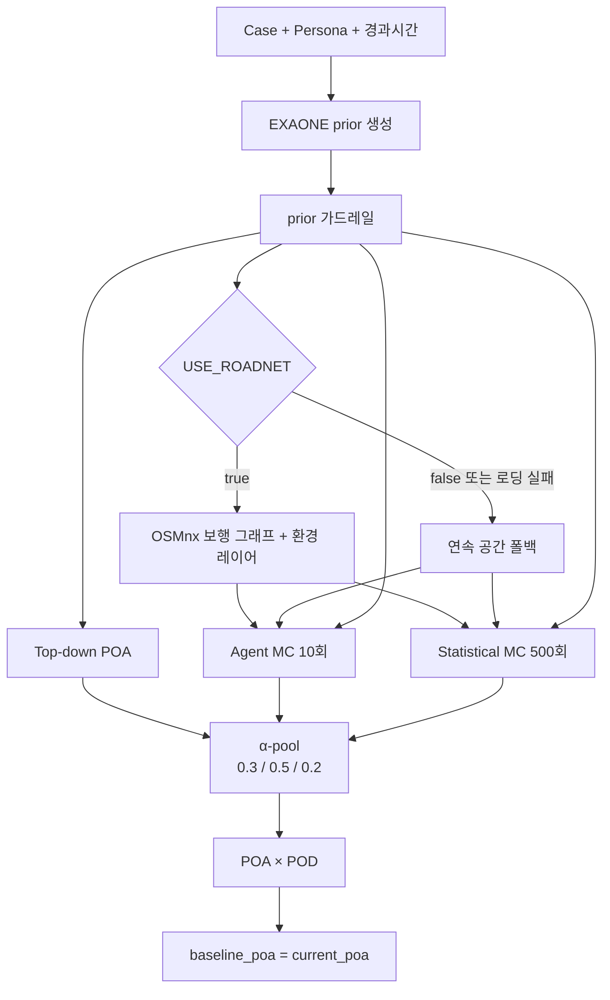
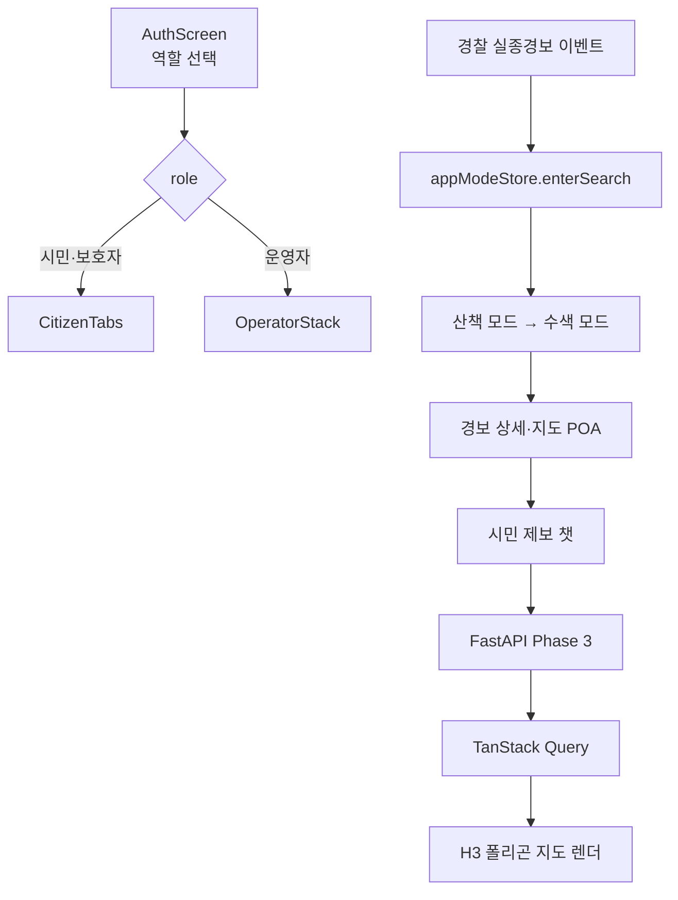

# 돌아오길

치매 노인·아동·지적장애인의 실종 시 이동 가능 구역을 확률적으로 예측하고, 해당 구역 안의 시민에게만 실종 알림을 보내 제보를 유도하는 수색 지원 서비스입니다.

`돌아오길`은 실종자의 경로를 하나의 선으로 단정하지 않습니다. 보호자가 사전 등록한 생활사와 행동 특성, 마지막 목격 위치와 시각, 고전 수색구조(SAR) 통계, 도로망과 주변 환경을 결합해 `P(위치 | 경과시간)` 형태의 위치 확률 분포(POA, Probability of Area)를 만듭니다.

이 문서는 `origin/develop`의 `5cab6a0`(PR #18, 2026-07-12 확인) 구현을 기준으로 작성했습니다.

## 서비스가 해결하는 문제

기존의 광역 실종 알림은 실제 수색 가능성과 무관한 시민에게도 전달되어 알림 피로와 방관자 효과를 만들 수 있습니다. 돌아오길은 다음 방식으로 이를 줄입니다.

1. 실종 전에는 보호자 인터뷰로 대상자의 익숙한 장소와 이동 성향을 등록합니다.
2. 실종 신고 시 마지막 목격 위치(LKP)와 시각을 수색의 새 출발점으로 설정합니다.
3. 여러 예측기를 결합해 단일 경로가 아닌 위치 확률 구름을 생성합니다.
4. 누적 확률이 높은 최소 구역을 선택해 해당 구역의 앱 사용자에게만 알림을 보냅니다.
5. 시민 제보가 들어오면 신뢰도에 따라 확률 분포를 갱신하거나 새 LKP에서 예측을 다시 실행합니다.

## 핵심 설계 원칙

- **LLM은 좌표와 전역 경로를 직접 만들지 않습니다.** Mi:dm과 EXAONE은 제한된 스키마 안에서 질문 문장화, 정보 추출, 이동 전략·목표·마음 상태 판단만 담당합니다.
- **이동의 물리적 제약은 알고리즘이 담당합니다.** Koester 이동거리 분포, 6개 이동 전략, OSMnx 보행 도로망, 환경 레이어와 몬테카를로 시뮬레이션이 실제 위치 분포를 만듭니다.
- **결과는 정답 경로가 아니라 확률 분포입니다.** 모든 POA는 H3 셀별 확률이며 합은 1입니다.
- **외부 모델이나 지도 API 장애가 신고 접수와 예측 전체를 막지 않게 설계합니다.** 각 단계는 통계 기본값, 안전 질문, 오프라인 지명 사전 또는 연속 공간 시뮬레이션으로 폴백합니다.
- **실종 전 정보와 실종 당시 정보를 분리합니다.** 안정적인 개인 특성은 Phase 0에서, LKP·시각·인상착의처럼 사건별 정보는 Phase 1에서 수집합니다.

## 전체 아키텍처



### Phase 간 핵심 데이터

| 단계 | 주요 입력 | 주요 처리 | 주요 출력 |
|---|---|---|---|
| Phase 0 | 보호자 대화 | 적응형 슬롯 인터뷰, 추출, 지오코딩 | `Persona` |
| Phase 1 | Persona ID, LKP, 시각, 선택적 사진·문서 | 신고 구조화, Case 생성, 도로망 사전 로딩 | `MissingReport`, `Case` |
| Phase 2 | Case, Persona, 경과시간 | EXAONE prior, 3-way POA, α-pool | `PredictionResult`, `current_poa` |
| Phase 3 | 현재 POA, 시민 제보 | 신뢰도 평가, 베이지안 갱신, 재예측 트리거, 알림 셀 선택 | 갱신 POA, 타겟 알림 |

### 모델과 알고리즘의 책임 경계

| 구성 요소 | 담당 | 담당하지 않는 것 | 장애·미설정 시 |
|---|---|---|---|
| Mi:dm | Phase 0 답변 추출·충족 판정, 선택된 슬롯의 질문 문장화 | 다음 슬롯 선택, 좌표·경로 생성 | 슬롯 대표 질문과 결정적 스텁으로 진행 |
| 한국어 문장 임베더 | 온보딩 대화와 슬롯 `embed_text`의 유사도 검색 | 답변 추출, 질문 생성 | 모델을 비우면 해시 기반 어휘 중첩 검색 |
| EXAONE | Phase 2 전략 prior, 끌림점·반경 등급, 게이지 발동 시 마음·목표 재해석 | 좌표, 전역 경로, 임의 목적지 생성 | 유형별 Koester·6전략 기본 prior 사용 |
| Koester + 6전략 + MC | 이동거리 제약과 워커 이동, 셀별 위치 확률 생성 | 자연어 해석 | 항상 알고리즘 경로로 실행 |
| OSMnx + 환경 레이어 | 보행 도로망 제약, 물·숲·공원·시장 거리와 토지피복 | 사람의 목표·감정 판단 | 연속 공간 시뮬레이션으로 폴백 |
| Kakao·Nominatim·Gazetteer | 자연어 장소를 좌표와 정밀도로 변환 | 이동 경로 예측 | 다음 지오코더로 순차 폴백 |
| VARCO·Upstage | 사진 인상착의·신고 문서 어댑터 자리 | 핵심 실시간 예측 | 현재 스텁이며 실패 필드만 비우고 접수 계속 |

이 경계를 통해 LLM이 사람의 맥락을 해석하되, 수색 지도의 좌표와 확률은 검증 가능한 알고리즘이 소유하도록 합니다.

## Phase 0: 보호자 사전 온보딩

Phase 0의 목적은 고정 설문을 다시 포맷하는 것이 아니라, 보호자의 답변 맥락에 따라 필요한 정보를 더 깊게 끌어내는 적응형 엘리시테이션입니다.

### 입력과 출력

- 입력: 보호자 이름, 선택적 대상자 유형, 보호자와 챗봇의 대화
- 출력: 이름·나이·유형·집 좌표·끌림점·행동 노트를 가진 `Persona`
- 모델 역할: 검색 모듈이 다음 슬롯을 선택하고, Mi:dm이 직전 답변을 구조화하며 선택된 슬롯을 자연스러운 존댓말 질문으로 표현

### 인터뷰 흐름



### 슬롯 검색

챗봇이 채워야 하는 정보 항목 하나를 슬롯이라고 부릅니다. 카탈로그는 페르소나 축 고도화 회의록(몸축·마음축·행동축)을 따라 16개로 구성됩니다: 공통 8개(기본 필드 2 + 몸축 2 + 마음축 3 + 행동축 1) + 치매 특화 4개 + 발달장애 특화 4개. 아동 특화 세트는 팀 결정으로 제외했으며(아동 유형은 공통 슬롯만 받음), '자폐'는 발달장애 세트로 라우팅됩니다. 저장 위치(`sink`)는 세 종류입니다.

- `field`: 이름, 나이, 유형, 현재 집 등 Persona 기본 필드
- `attraction`: 옛집, 직장, 선호 대상 장소처럼 좌표화할 끌림점
- `behavior`: 길을 잃었을 때의 행동, 보행 능력, 대인 반응 등 행동 노트

각 슬롯은 `label`, 축(`axis`)과 축 DB 필드명(`axis_field`), 회의록 원문 씨앗 질문, 하위변수를 내린 `probes`(꼬리질문 각도), `filled_when`, SAR 근거인 `why`, `keywords`, 선택적 `risk`, 답변 예시(`answer_example`)를 정의합니다. 검색용 `embed_text`는 `label + question + probes + keywords + why`로 구성되며(답변 예시는 검색 오염 방지를 위해 제외), `filled_when`은 Mi:dm의 추출·충족 판정에 사용됩니다. 답변 예시는 첫 질문에서 낭독하지 않고, 꼬리질문에서 답이 두루뭉술할 때만 구체성 눈높이로 활용합니다. 인터뷰가 수집한 사실은 슬롯의 `axis_field`로 묶여 `Persona.axis_evidence`에 저장되며, 이후 축 점수(0.1~0.9) 컴파일 단계의 입력이 됩니다.

다음 질문 선택 과정은 다음과 같습니다.

1. 최신 답변을 앵커로 삼고 관련성이 낮은 과거 사용자 턴을 제거합니다.
2. 남은 대화를 검색 쿼리로 임베딩합니다.
3. 대상자 유형에 유효하면서 아직 충족·소진되지 않은 슬롯과 코사인 유사도를 계산합니다.
4. 최고 유사도가 `0.32` 이상이면 피벗 모드로 전환해 다음 점수로 재정렬합니다.

```text
score = cosine_similarity + tier_bonus + gated_risk - asked_penalty
```

5. 강한 관련 신호가 없으면 임의의 질문을 선택하지 않고 기본 Tier·카탈로그 순서를 유지합니다.
6. 한 슬롯을 두 번 물어도 충족되지 않으면 소진 처리하고 다음 슬롯으로 넘어갑니다. 전체 질문에는 40개 상한이 있습니다.

### 질문 가드레일과 저장

- 주민등록번호와 휴대전화 번호 패턴은 저장·프롬프트 전달 전에 마스킹합니다.
- 의료·법률·위해 관련 금지어 또는 슬롯과 동떨어진 생성 질문은 차단합니다.
- 차단 시 미리 정의한 대표 질문으로 대체하므로 질문 주제는 슬롯 스키마 안에 머뭅니다.
- 집과 끌림점은 `Kakao Local → Nominatim → 오프라인 Gazetteer` 순으로 좌표화합니다.
- 지오코딩 결과에는 `poi > address > dong > approx` 정밀도를 기록하고 중복 장소는 더 정밀한 결과를 남깁니다.

### API

| 메서드 | 경로 | 설명 |
|---|---|---|
| `POST` | `/phase0/interviews` | 인터뷰 시작 |
| `POST` | `/phase0/interviews/{session_id}/answers` | 답변 반영과 다음 질문 생성 |
| `POST` | `/phase0/personas` | 구조화 필드로 Persona 직접 등록 |
| `GET` | `/phase0/personas/{persona_id}` | Persona 조회 |

## Phase 1: 실종 신고 접수

Phase 1은 사전 등록 정보와 사건 당시 정보를 결합해 예측의 중심 객체인 `Case`를 생성합니다. 골든타임을 지키기 위해 사진·문서 모델이나 도로망 API가 실패해도 신고 접수는 계속됩니다.

### 처리 과정

1. 신고자가 대상자 유형, 마지막 목격 위치 `lkp`, 마지막 목격 시각 `lkp_time`, 선택적 `persona_id`를 제출합니다.
2. 사진이 있으면 VARCO-Vision 어댑터가 인상착의를 `Appearance`로 추출합니다.
3. 신고 문서가 있으면 Upstage 어댑터가 신고자 정보를 `ReporterInfo`로 추출합니다.
4. 외부 모델 호출이 실패하면 해당 필드만 비우고 다음 단계로 진행합니다.
5. `MissingReport`와 상태가 `intake`인 `Case`를 생성합니다.
6. `ROADNET_PRELOAD=true`이면 LKP 반경의 OSMnx 보행 그래프를 미리 로딩·캐시합니다. 실패하더라도 접수 결과는 반환합니다.

### 현재 구현 범위

- REST API는 실제 파일 업로드가 아니라 `with_photo`, `with_document` 불리언 플래그를 받습니다.
- VARCO-Vision과 Upstage는 현재 실제 외부 API가 연결되지 않은 스텁입니다.
- 현재 확정 모델 로스터의 실시간 백본은 Mi:dm과 EXAONE이며, VARCO·Upstage 코드는 선택적 어댑터 자리로 남아 있습니다.
- 저장소는 DB가 아니라 프로세스 메모리의 `dict`입니다. 서버가 재시작되면 데이터가 사라집니다.

### API

| 메서드 | 경로 | 설명 |
|---|---|---|
| `POST` | `/phase1/reports` | 신고 접수 후 Case 생성 |
| `GET` | `/phase1/cases/{case_id}` | Case와 현재 상태 조회 |

## Phase 2: 이동 구역 예측

Phase 2는 `Case + Persona + 경과시간`을 받아 Top-down, Agent Monte Carlo, Statistical Monte Carlo의 세 분포를 만들고 하나의 최종 POA로 결합합니다.

### 전체 처리 순서



### 2-1. EXAONE prior 생성

EXAONE은 좌표를 예측하지 않고 다음 구조화 파라미터만 반환합니다.

- `strategy_probs`: 익숙한 경로 추종, 방향 유지, 무작위 배회, 되돌아가기, 제자리 머무름, 끌림점 지향의 6전략 확률
- `attraction_levels`: Persona에 실제로 존재하는 끌림점별 `상/중/하`
- `radius_level`: 같은 유형의 평균보다 이동 반경이 큰지에 대한 `상/중/하`
- `reasoning`: 판단 근거

가드레일은 알려진 전략만 남기고 ε-floor 후 재정규화합니다. 끌림점 등급은 고정 가중치 `상=3, 중=2, 하=1`로 변환하고, 하나의 끌림점이 분포의 60%를 넘지 못하게 제한합니다. 반경은 EXAONE이 직접 수치를 만들지 않도록 Koester 프로파일의 `mu`만 최대 `±0.4` 보정하고 `sigma`는 고정합니다. 호출·파싱 실패 시 유형별 통계 기본값을 사용합니다.

### 2-2. 도로망과 환경 레이어

`USE_ROADNET=true`일 때 LKP 중심 반경 3km의 OSM 보행 그래프를 다운로드하거나 GraphML 캐시에서 읽습니다. 끌림점과 LKP는 가장 가까운 도로 노드에 스냅됩니다.

환경 레이어는 도로 노드마다 다음 정보를 부착합니다.

- OSM: 물, 숲, 공원, 시장까지의 거리
- 환경부 EGIS WMS: 토지피복 대분류·세분류·코드

도로망 또는 환경 데이터 로딩이 실패하면 Phase 2 전체를 중단하지 않고 도로 제약이 없는 연속 공간 워커로 폴백합니다.

### 2-3. Top-down POA

몬테카를로를 사용하지 않는 해석적 분포입니다.

1. Koester 로그정규 이동거리 분포와 경과시간으로 LKP 중심 거리 링을 만듭니다.
2. Persona 끌림점에는 반경 300m의 가우시안 범프를 더합니다.
3. `0.6 × 거리 링 + 0.4 × 끌림점 효과`로 H3 셀 점수를 계산하고 합이 1이 되도록 정규화합니다.

### 2-4. Agent Monte Carlo

기본 10개의 롤아웃이 LKP에서 출발합니다. 각 롤아웃은 prior의 확률에 따라 6개 이동 전략 중 하나를 샘플링하며, 그래프 모드에서는 도로 노드만 따라 이동합니다.

갈림길의 다음 노드는 목표 방위와 현재 진행 방위에 대한 확률분포로 선택합니다. 혼란도가 높을수록 방향 집중도 `κ`가 낮아져 선택이 무작위에 가까워집니다. 워커는 다음 중 하나가 발생할 때 종료됩니다.

- 끌림점 도달
- Koester에서 샘플링한 LKP 대비 직선 이탈거리 소진
- 막다른 노드 도달
- 최대 300스텝 도달
- 7세 미만 아동이 물가 인접 노드에 도달

그래프를 걷는 동안 롤아웃별 내인성 게이지를 갱신합니다.

- 누적 게이지: 피로 `F`, 혼란 `C`, 혐오환경 노출 `E`
- 파생 게이지: 귀소 충동 `H`, 불안 `A`
- 발동 방식: 고정 임계가 아니라 로지스틱 hazard
- `F` 발동: 알고리즘이 휴식과 남은 이동거리 감소를 처리하며 EXAONE은 호출하지 않음
- `H` 또는 `A` 발동: EXAONE이 마음 상태와 목표를 재해석하며 워커당 최대 1회 호출

EXAONE이 바꿀 수 있는 목표는 Persona에 이미 등록된 끌림점 라벨로 제한됩니다. 새 좌표나 존재하지 않는 장소를 만들 수 없습니다.

### 2-5. Statistical Monte Carlo

기본 500개의 워커가 Agent MC와 같은 도로망과 Koester 거리 제약 아래 이동하지만, 이동 중 마음 게이지로 EXAONE을 다시 호출하지 않습니다. 재현 가능한 비교 분포와 넓은 탐색 기반을 제공하기 위한 경로입니다.

현재 구현에서는 Statistical MC도 파이프라인 앞단에서 생성한 동일한 `prior`를 입력받습니다. 따라서 EXAONE이 활성화된 경우 이 분포를 엄밀한 의미의 “AI 완전 제거 베이스라인”으로 볼 수는 없습니다. 현재 비교가 격리하는 것은 주로 **이동 중 마음 재해석의 추가 효과**입니다.

### 2-6. 분포 결합과 상태 저장

세 분포를 다음 고정 가중치로 결합합니다.

```text
Top-down 0.3 + Agent MC 0.5 + Statistical MC 0.2
```

- 제보가 3건 미만이면 linear pool을 사용해 어느 한 모델이 높게 본 구역도 보존합니다.
- 제보가 3건 이상인 재실행에서는 log-linear pool을 사용해 세 분포가 함께 지지하는 구역에 집중합니다.
- 마지막에 `POA × POD`를 적용하지만, 현재 POD는 모든 셀에서 1인 균일 스텁이므로 분포를 바꾸지 않습니다.
- 최종 분포를 `baseline_poa`와 `current_poa`에 저장하고 Case 상태를 `predicted`로 변경합니다.

### API와 응답

| 메서드 | 경로 | 설명 |
|---|---|---|
| `POST` | `/phase2/cases/{case_id}/predict?seed=42` | 3-way 예측 실행. `seed`는 재현용 선택값 |

응답은 `prior`, `poa_topdown`, `poa_bottomup`, `poa_statistical`, `poa_combined`를 포함합니다.

## Phase 3: 알림·제보·POA 갱신

Phase 3는 Phase 2의 확률 분포를 실제 수색 행동으로 연결합니다.

1. `current_poa`의 셀을 확률 내림차순으로 정렬합니다.
2. 누적 확률 80%를 포함하는 최소 셀 집합을 알림 대상 구역으로 선택합니다.
3. 시민 제보에서 위치·시각·사진·행동 단서를 바탕으로 신뢰도 `p`를 계산합니다.
4. `p < 0.2`이면 파기하고, `0.2 ≤ p < 0.8`이면 혼합 likelihood로 현재 POA를 갱신합니다.
5. `p ≥ 0.8`이면서 위치와 시각이 특정되면 해당 지점을 새 LKP로 설정해 Phase 2를 다시 실행합니다.
6. 주기 45분 또는 baseline 대비 KL divergence가 0.5를 넘는 경우에도 재실행 후보가 됩니다.

### API

| 메서드 | 경로 | 설명 |
|---|---|---|
| `POST` | `/phase3/cases/{case_id}/alerts` | 누적 POA 80%를 덮는 최소 셀 집합을 선택하고 알림 스텁 실행 |
| `POST` | `/phase3/cases/{case_id}/tips` | 시민 제보의 신뢰도 계산, 층1 갱신과 조건부 층2 재실행 |
| `GET` | `/phase3/cases/{case_id}/poa?top=20` | 현재 POA 상위 셀과 H3 육각형 폴리곤 조회 |
| `GET` | `/phase3/cases/{case_id}/rerun-check` | 주기·KL divergence 기반 재실행 필요 여부 조회 |

전체 요청·응답 모델의 기준 문서는 [`API_CONTRACT.md`](API_CONTRACT.md)입니다. 다만 이 파일에는 초기 백본 설명이 일부 남아 있으므로, 현재 동작을 판단할 때는 Phase별 API 라우터와 스키마를 함께 확인해야 합니다.

## 프런트엔드 아키텍처

프런트엔드는 Expo SDK 57 기반 React Native 애플리케이션입니다. 평시에는 산책 앱으로 동작하고, 경찰 실종경보 연동 이벤트가 들어오면 같은 애플리케이션이 수색 도구로 전환됩니다.



### 상태와 화면 분리

- `authStore`: 시민·보호자·운영자 역할과 데모 인증 상태를 관리합니다. 운영자 스택은 시민 라우트에서 접근하는 방식이 아니라 컴포넌트 트리 자체가 분리됩니다.
- `appModeStore`: `walk`와 `search`, 활성 Case, 경보 심각도, 수색 진입 시각을 관리합니다. 보호자가 앱에서 직접 실종 상태를 발동하지 않습니다.
- `missingPersonStore`: 전 화면이 동일한 실종자 프로필을 참조하게 해 이름·나이·성별 하드코딩 불일치를 막습니다.
- TanStack Query: POA, 경보, 검증 결과와 발견 요약 등 서버 상태 조회 경계를 담당합니다.
- `PoaHeatmap`: 백엔드가 반환한 H3 셀 폴리곤을 그대로 렌더링합니다. 색상뿐 아니라 명도·패턴·수치 라벨을 함께 사용합니다.

### 역할별 사용자 흐름

| 역할 | 주요 흐름 |
|---|---|
| 시민 | 경보 수신 → 실종자·예측 구역 확인 → 목격 제보 → 수색 현황 확인 |
| 보호자 | 평시 예방 등록 → 경찰경보 연동 확인 → 수색 현황 확인 |
| 운영자 | Case·POA·예측 근거 확인 → 알림·제보 변화 모니터링 → 발견 처리·검증 확인 |

### 현재 백엔드 연동 수준

- 기본값은 `USE_MOCK=true`이며 대부분의 화면은 결정적 목 데이터로 동작합니다.
- `USE_MOCK=false`에서 POA 조회와 알림 API 호출은 연결되어 있습니다.
- 시민 제보 전송은 백엔드 호출까지 수행하지만 응답을 화면 도메인 모델로 변환하는 작업이 남아 있습니다.
- 온보딩 화면은 아직 Phase 0 인터뷰 API가 아니라 로컬 대화 스크립트를 사용합니다.
- 교차검증·검증 리포트·발견 요약과 실제 푸시·백그라운드 지오펜스는 목 또는 미구현 상태입니다.

상세한 화면·디자인 시스템·실행 방법은 [`frontend/README.md`](frontend/README.md)를 참고하십시오.

## 최초 설계 대비 현재 구현

최초 백엔드 백본 커밋 `b08a89a`의 핵심은 `Phase 0 Persona → Phase 1 Case → Phase 2 3-way POA → Phase 3 제보 갱신`이었습니다. 현재 구현은 이 데이터 흐름과 “LLM은 구조화 판단, 알고리즘은 좌표와 이동”이라는 역할 분리를 유지하면서 실제 도로망·환경·가드레일·게이지를 추가했습니다.

| 설계 항목 | 현재 판정 | 근거와 차이 |
|---|---|---|
| 적응형 온보딩으로 안정적 Persona 생성 | 대체로 일치 | 축 기반 16개 슬롯(몸축·마음축·행동축), 히스토리-어웨어 검색, Mi:dm 추출·문장화, 확인 게이트, 지오코딩 구현 |
| LLM이 좌표·전역 경로를 직접 생성하지 않음 | 일치 | EXAONE은 전략·등급·기존 목표 라벨만 출력하며 가드레일이 수치화 |
| OSMnx 도로망 위 확률적 이동 | 조건부 일치 | 그래프 워커는 구현됐지만 `USE_ROADNET` 기본값이 `false`라 기본 실행은 연속 공간 폴백 |
| 고전 SAR + 인지 동역학 중심 | 대체로 일치 | Koester, 6전략, 게이지와 hazard 구현. 계수와 전략 prior는 아직 잠정값 |
| EXAONE 희소 호출 | 일치 | Agent 워커에서 H/A 발동 시에만, 워커당 최대 1회 호출 |
| 500 워커 몬테카를로 | 부분 일치 | Statistical MC는 500회, 비용이 발생할 수 있는 Agent MC는 10회로 축소 |
| AI 기여도를 분리한 통계 베이스라인 | 부분 불일치 | Statistical MC도 동일한 EXAONE prior를 공유하므로 동적 마음 재해석만 분리됨 |
| 환경 기반 POD | 미완성 | 환경 레이어는 게이지에 쓰이지만 최종 `POA×POD`의 POD는 균일 스텁 |
| 실사진·문서 자동 추출 | 미완성/보류 | API는 불리언 플래그이고 VARCO·Upstage는 스텁 |
| 영속 저장과 운영 알림 | 미완성 | 인메모리 저장소, FCM·사용자 위치 인덱스 미연동 |

### 확인된 구현 주의사항

- Phase 0의 히스토리 재구성은 관련 없는 과거 턴을 제거하지만, 현재 recency 반복 가중의 순회 방향이 의도와 반대로 적용될 가능성이 있어 교정이 필요합니다.
- Phase 0 기본 필드는 `first-wins`로 저장되어 요약 확인 단계에서 이름·나이·집을 정정해도 기존 값이 덮어써지지 않을 수 있습니다.
- Persona 확정 중 집 지오코딩이 실패하면 메시지는 재확인을 요청하지만 세션을 `done=true`로 설정하므로 재질문 흐름과 상태가 맞지 않습니다.
- Phase 2의 핵심 그래프·환경·마음 재해석 경로는 `USE_ROADNET=true`일 때만 활성화됩니다.
- `API_CONTRACT.md`와 `backend/README.md`에는 초기 백본 설명이 일부 남아 있어 실제 구현과 함께 갱신해야 합니다.

## 빠른 시작

### 백엔드

```bash
cd backend
python -m venv .venv
source .venv/bin/activate
pip install -r requirements.txt
cp .env.example .env
uvicorn app.main:app --reload
```

- API: `http://localhost:8000`
- Swagger: `http://localhost:8000/docs`

실제 도로망·환경 레이어를 사용하려면 `.env`에 다음 값을 설정합니다.

```dotenv
USE_ROADNET=true
ROADNET_PRELOAD=true
```

Mi:dm, EXAONE, Kakao Local 설정은 [`backend/.env.example`](backend/.env.example)을 참고하십시오. 외부 모델 키가 없어도 통계 기본값과 스텁으로 API 흐름을 실행할 수 있습니다.

### 프런트엔드

```bash
cd frontend
npm ci
npm start
```

프런트엔드 구조와 실행 설정은 [`frontend/README.md`](frontend/README.md)를 참고하십시오.

## 테스트

```bash
cd backend
python -m pytest -q
```

도로망 fixture 기반 시뮬레이션 sanity test:

```bash
python scripts/sim_testset.py --fixture
```

실운영 구성 E2E 스모크:

```bash
python scripts/e2e_smoke.py
```

E2E 스모크는 `USE_ROADNET=true`를 사용하며, 캐시가 없으면 OSM·EGIS 네트워크 접근이 필요합니다. `.env`에 모델 키가 있으면 실제 EXAONE과 Mi:dm도 호출합니다.

## 주요 디렉터리

```text
Come-back-home/
├── API_CONTRACT.md
├── backend/
│   ├── app/
│   │   ├── api/             Phase별 REST 라우터
│   │   ├── geo/             H3, 지오코딩, OSMnx 도로망, 환경 레이어
│   │   ├── llm/             Mi:dm, EXAONE, VARCO, Upstage 어댑터
│   │   ├── phase0/          적응형 온보딩과 Persona 확정
│   │   ├── phase1/          실종 신고와 Case 생성
│   │   ├── phase2/          prior, 가드레일, 게이지, 시뮬레이션, POA 결합
│   │   ├── phase3/          제보 신뢰도, POA 갱신, 재실행, 알림
│   │   ├── schemas/         Pydantic 도메인 모델
│   │   └── storage.py       인메모리 Repository
│   ├── scripts/             E2E·시뮬레이션·모델 프로브
│   └── tests/
└── frontend/                Expo React Native 애플리케이션
```

## 현재 개발 우선순위

1. Phase 0의 정정·지오코딩 실패 상태와 히스토리 recency 계산 교정
2. `USE_ROADNET=true` 운영 프로필 확정과 도로망·환경 캐시 배포 전략 수립
3. Statistical MC에 통계 전용 prior를 분리해 AI 기여도 비교의 독립성 확보
4. 잠정 게이지 계수와 6전략 prior를 테스트셋으로 보정
5. 환경·유동인구·시간대를 반영한 실제 POD 구현
6. 실제 파일 업로드, DB, 푸시 알림과 사용자 위치 인덱스 연동
7. 루트 API 계약과 백엔드 README를 현재 코드에 맞게 동기화
