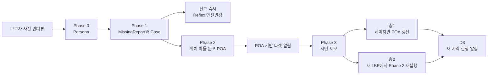
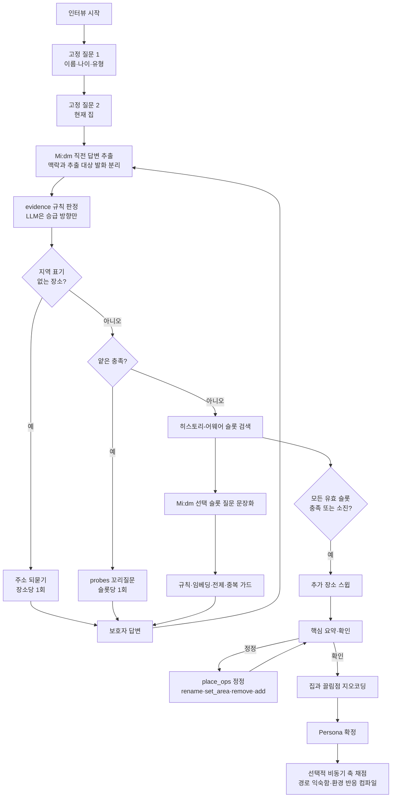
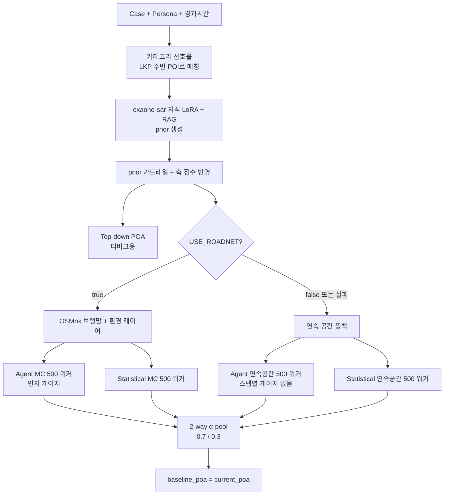
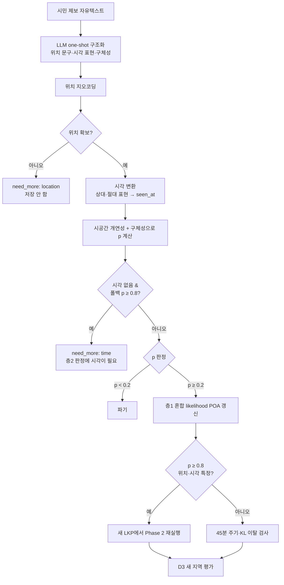
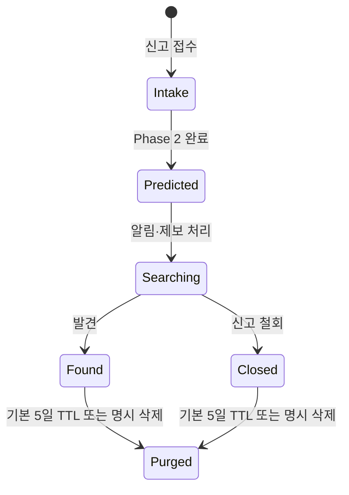

# 돌아오길

치매 노인의 실종 시 이동 가능 구역을 확률적으로 예측하고, 그 구역 안의 시민에게만 실종 알림을 보내 제보를 유도하는 수색 지원 서비스입니다.

돌아오길은 실종자의 이동을 하나의 정답 경로로 단정하지 않습니다. 보호자가 사전 등록한 생활사·행동 특성, 마지막 목격 위치와 시각, 고전 수색구조(SAR) 통계, 도로망과 주변 환경을 결합해 `P(위치 | 경과시간)` 형태의 위치 확률 분포(POA, Probability of Area)를 만듭니다.

> 구현 확인 기준: `origin/develop` [`3d92678`](https://github.com/Donghaeng-AI-ROOKIE/Come-back-home/commit/3d926783c60537f9ec93f0ff03e7660d4077b074), 2026-07-31
>
> 상세 구현 문서: [`docs/IMPLEMENTATION_ARCHITECTURE.md`](docs/IMPLEMENTATION_ARCHITECTURE.md)

## 현재 구현 상태

| 영역 | 상태 | 현재 동작 |
|---|---|---|
| Phase 0 보호자 온보딩 | 구현, 일부 기능 플래그 | 적응형 슬롯 인터뷰, Mi:dm 추출·질문 문장화, 지오코딩, Persona 확정 |
| Phase 0 축 컴파일 | 구현, 기본 비활성 | EXAONE 축 채점, 경로별 익숙함, 개인 환경 반응 컴파일. `AXIS_SCORING_ENABLED=false`가 기본 |
| Phase 1 실종 신고 | 백본 구현 | Case 생성, 즉시 안전반경 알림, 선택적 도로망 사전 로딩 |
| Phase 2 위치 예측 | 구현 | `exaone-sar` 지식 LoRA와 RAG로 prior 생성, `exaone-mind-dem5`로 선택적 마음 재해석, Koester·MC·H3로 POA 계산 |
| Phase 3 알림·제보 | 로직 구현 | 타겟 셀 선택, 자유텍스트 제보 구조화·지오코딩·시각 변환, 되묻기 게이트, 신뢰도 `p`, 층1 갱신, 층2 재실행, D3 새 지역 알림 |
| 개인정보 수명주기 | 백본 구현 | 종결, TTL, 명시 삭제, 연쇄 파기, 비식별 감사로그 |
| 프런트엔드 | 목 중심 구현 | 3역할·산책/수색 모드·11개 화면. POA 조회 일부만 실백엔드 연결 |
| 운영 인프라 | 미구현 | 영속 DB, FCM/APNs, 사용자 위치 인덱스, 자동 스케줄러 |

현재 지원 Persona 유형은 `dementia` 하나입니다. 아동 Persona는 PR #47에서 백엔드 스키마·알고리즘·테스트에서, PR #49에서 E2E 대시보드에서 제거됐고, 발달장애(`intellectual_disability`) Persona는 2026-08-03 대상 단일화 결정으로 제거됐습니다.

## AI 모델 구성 한눈에 보기

돌아오길은 하나의 모델에 모든 판단을 맡기지 않습니다. 자연어를 해석하는 모델과 위치 확률을 계산하는 알고리즘을 분리하고, EXAONE도 작업별 전용 경로로 나눕니다.

| 사용 단계 | 모델 경로 | 역할 | 비고 |
|---|---|---|---|
| Phase 0 인터뷰 | Mi:dm | 보호자 답변 추출, 질문 문장화 | 다음 질문 대상은 코드가 선택 |
| Phase 0 축 컴파일 | EXAONE 기본 모델 (`AXIS_SCORING_MODEL`) | 보호자 근거를 A~F 성향 등급으로 분류 | SAR·mind LoRA 미사용 |
| Phase 2 초기 prior | 지식 LoRA (`EXAONE_MODEL`, 운영명 `exaone-sar`) | 이동 전략·장소 끌림·이동 반경 등급 생성 | 논문 RAG 사용 |
| Phase 2 마음 재해석 | 행동 LoRA (`MIND_MODEL=exaone-mind-dem5`) | 게이지 발동 시 행동·목표·혼란 등급 재해석 | 목표·혼란·행동 반영(행동 연결 기본 켜짐, PR #118) |
| Phase 3 제보 구조화 | 별도 `tip_llm` 엔드포인트 | 위치 문구·시각 표현·구체성 구조화 | 실험 선택 모델은 Mi:dm 2.0 Mini, 미설정 시 규칙 스텁 |

`EXAONE_MODEL`과 `AXIS_SCORING_MODEL`은 저장소 기본값이 비어 있어 배포 환경에서 지정해야 합니다. 특히 `EXAONE_MODEL=exaone-sar`를 사용할 때 `AXIS_SCORING_MODEL`도 비워 두면 축 채점이 지식 LoRA로 잘못 라우팅되므로, EXAONE 기본 모델 ID를 별도로 설정해야 합니다.

현재 모델 연결 범위에는 두 가지 중요한 경계가 있습니다.

- `exaone-mind-dem5`의 v2 계약은 `behavior`, `goal_label`, `confusion_level`을 출력하며, `behavior`→이동 전략 연결은 구현돼 기본 켜짐입니다(PR #109·#118).
- Phase 3 실모델 실험에서는 시각 언급이 없는 제보 26건 중 20건에서 모델이 시간을 만들어 냈습니다. 현재 코드는 시각 값의 형식과 `[lkp_time, now]` 범위만 검사하고, 시민 원문에 실제 시각 표현이 있는지는 대조하지 않습니다.

## 서비스 흐름



### 핵심 데이터

| 단계 | 입력 | 처리 | 출력 |
|---|---|---|---|
| Phase 0 | 보호자 대화 | 적응형 인터뷰, 정보 추출, 지오코딩 | `Persona` |
| Phase 1 | Persona ID, LKP, 시각, 선택적 사진·문서 | 신고 구조화, Case 생성, 즉시 안전반경 | `MissingReport`, `Case` |
| Phase 2 | Case, Persona, 경과시간 | prior, Top-down, Agent MC, Statistical MC, 2-way 결합 | `PredictionResult`, POA |
| Phase 3 | 현재 POA, 시민 제보 | 신뢰도, 층1 갱신, 층2 재실행, 새 지역 판정 | `Tip`, 갱신 POA, 알림 셀 |

## 핵심 설계 원칙

- **LLM은 좌표와 전역 경로를 직접 만들지 않습니다.** Mi:dm과 EXAONE은 제한된 스키마 안에서 질문 문장화, 정보 추출, 이동 성향과 마음 상태 판단만 담당합니다.
- **EXAONE은 작업별로 분리합니다.** prior는 지식 LoRA와 RAG, 마음 재해석은 행동 LoRA, 축 채점은 기본 모델을 사용합니다.
- **위치와 이동은 알고리즘이 소유합니다.** Koester 이동거리 분포, 6개 이동 전략, OSMnx 보행망, 환경 레이어, 몬테카를로 시뮬레이션이 실제 좌표 분포를 만듭니다.
- **출력은 선이 아니라 확률 구름입니다.** POA는 H3 resolution 9 셀별 확률이며 합은 1입니다.
- **외부 장애는 격리합니다.** 모델·지도 API가 실패해도 통계 기본값, 안전 질문, 오프라인 지명 사전, 연속 공간 시뮬레이션으로 흐름을 유지합니다.
- **실종 전 정보와 사건 정보를 분리합니다.** 안정적인 Persona는 Phase 0에서, LKP·시각·인상착의는 Phase 1에서 다룹니다.
- **알림은 확률이 높은 최소 구역에 제한합니다.** 기본 누적 커버리지는 80%, 셀 수 상한은 500개입니다.

## Phase 0: 보호자 사전 온보딩

Phase 0은 고정 설문이 아니라 보호자 답변의 화제와 미수집 항목을 함께 보는 적응형 인터뷰입니다.



### 인터뷰 구현

- 질문 카탈로그는 12개 슬롯으로 구성됩니다: 공통 8개, 치매 특화 4개입니다.
- 첫 질문과 현재 집 질문은 고정하고, 이후 질문은 한국어 문장 임베딩으로 선택합니다.
- 최신 답변과 관련 있는 과거 발화만 검색 문맥에 남깁니다.
- 최고 코사인 유사도가 `0.32` 이상이면 현재 화제 관련 슬롯으로 피벗합니다.
- 강한 관련 신호가 없으면 질문 횟수, Tier, 카탈로그 순서로 진행합니다.
- 슬롯당 최대 2회, 전체 최대 40개 질문으로 반복을 제한합니다.
- Mi:dm은 다음 슬롯을 자율 선택하지 않습니다. 코드가 선택한 슬롯의 답을 추출하고 질문을 한 문장으로 표현합니다.
- 확보한 사실이 1개 이하인데 Mi:dm이 충족으로 판정하면, 슬롯을 닫기 전에 `SlotSpec.probes` 각도로 한 번 더 파고듭니다(슬롯당 1회). Mi:dm이 재탕 질문을 내면 probes 문구를 직접 낭독합니다. 씨앗 질문은 첫 물음표에서 잘리기 때문에 하위 항목은 이 꼬리질문이 유일한 통로입니다.
- 추출 프롬프트는 `이전 대화(맥락)`와 `추출 대상 발화`를 분리해 전달합니다. 하나로 합쳐 주면 긴 대화에서 직전 답변의 발견지를 놓치던 실측(0/3 → 3/3)이 있었습니다.
- 프롬프트에 실린 답변 예시가 추출 입력으로 되돌아가 환각 노트가 되는 것을 막기 위해, 추출용 대화에서는 질문의 `(예: …)` 부분을 제거합니다.

### 저장과 가드레일

- 주민등록번호와 휴대전화 번호는 저장·프롬프트 전달 전에 마스킹합니다.
- 이름·나이·집은 Mi:dm 장애 시 규칙 기반 최소 추출을 수행합니다.
- 추출 사실과 보호자 원발화를 `axis_evidence`, `axis_quotes`로 분리 보존합니다.
- 장소는 근거를 `mention_only`, `caregiver_report`, `previous_missing_found`로 태깅하고, 각각 `0.3` / `0.5` / `0.9` 계수로 `AttractionPoint.weight`를 채웁니다.
- **evidence 등급은 한국어 표면형 규칙이 판정하고 Mi:dm 판정은 승급 방향으로만 덮습니다.** Mi:dm이 “자주 가세요”, “가야 한다는 말을 종종 합니다”까지 `mention_only`로 떨구는 것이 실호출 A/B에서 4/4로 확인됐고 프롬프트 수정으로는 바뀌지 않았습니다.
- 최상위 등급(`0.9`)은 두 겹으로 방어합니다. 이번 발화에 실제로 언급된 장소에만 승급하고(이전 턴 장소를 되뱉을 때 근거가 전이돼 평소 다니던 시장이 발견지로 둔갑하던 실측), 발화에 발견 근거가 없으면 모델 판정을 되돌립니다(“가게를 하신 적이 있어서”를 발견지로 분류하던 실측).
- 발견 장소가 추출에서 누락되면 발화의 지명으로 끌림점을 직접 만들고, 그래도 빈손이면 추출을 1회 재시도합니다.
- 집은 `Kakao Local → Nominatim → Gazetteer` 순으로 먼저 좌표화합니다.
- 끌림점은 집 기준 20km 이내 결과만 받아 전국 단위 오검색을 차단합니다.
- **지역 표기가 없는 끌림점은 그 턴에 주소를 되묻습니다(장소당 1회).** 되묻지 않으면 지오코딩이 실패해 그 장소가 페르소나에서 통째로 사라집니다. Mi:dm이 “예전에 살던 집”을 장소로 아예 안 뽑는 것도 실측(0/3)이라 정규식으로 라벨을 먼저 만듭니다.
- 발화에 근거가 없는 지역 표기는 버리고 되묻습니다. Mi:dm이 자택 동네를 그대로 복사해 넣던 실측 대응입니다.
- `대흥역 2번 출구`처럼 정확한 표기로 지오코딩이 실패하면 `대흥역`으로 접미어를 떼어 재시도합니다. 라벨은 보호자 표현을 유지합니다.
- 확인 단계의 정정은 기존 `first-wins` 값을 덮어쓸 수 있고, 집 지오코딩 실패 시 세션을 닫지 않고 재질문합니다.
- **장소 정정은 `place_ops` 닫힌 어휘(`rename` / `set_area` / `remove` / `add`)로 받고 적용은 코드가 합니다.** 기존 슬롯 재추출로는 이름 교체·삭제를 표현할 수단이 없었고, 장소 정정이 `home` 슬롯으로 랭킹돼 수색 원점이 조용히 바뀌던 실측이 있었습니다. 삭제는 발화에 뺄 의사가 있을 때만, `home` 교체는 “지금 사는 집”을 명시할 때만 허용합니다.
- Mi:dm이 `behavior_notes`를 빈 배열로 내는 실측(3/3)에 대비해 원발화를 폴백 저장합니다. 축 근거가 3축에서 7축으로 늘었습니다.

### 축 점수와 경로 익숙함

`AXIS_SCORING_ENABLED=true`일 때 Persona 확정 후 `AXIS_SCORING_MODEL`로 지정한 EXAONE 기본 모델이 축별 A~F 정성 분류를 수행합니다. 지식 LoRA(`exaone-sar`)를 축 채점에 적용했을 때 골드셋 정확일치가 `0.88 → 0.74`로 낮아졌기 때문에 prior용 어댑터와 분리합니다.

- 기준표는 [`backend/app/phase0/axis_rubric.md`](backend/app/phase0/axis_rubric.md)가 단일 소스입니다.
- 코드가 A~E를 `0.1/0.3/0.5/0.7/0.9`로 변환합니다.
- 보호자 원문 인용 검증과 기본 3회 다수결을 사용합니다.
- `F`와 근거 없는 축은 0점이 아니라 미채점으로 남겨 Phase 2 기본값 폴백을 허용합니다.
- 같은 백그라운드 작업에서 자전적 목적지별 `route_familiarity`도 A~E로 컴파일합니다.
- 혼자 자주 가는 목적지는 별도 채점 없이 기본 익숙함 `0.8`을 사용합니다.
- 같은 작업에서 `behavior_notes`의 개인 환경 반응(`Persona.env_responses`)도 컴파일합니다. 판정 대상은 envlayer가 실제 수집하는 `water`·`forest`·`park`·`market` 닫힌 어휘뿐이고, 방향(접근·회피)과 강도(상·중·하)만 받아 코드가 수치화합니다. 실행마다 방향이 갈리면 근거 불안정으로 보고 채택하지 않습니다.

세 컴파일러 모두 원문 인용 실존 검증과 다수결이라는 같은 신뢰도 확보 방식을 씁니다. 실패는 빈 결과로 흡수되며, 소비처가 중립값으로 폴백하므로 예측이 도입 이전과 같아집니다.

주요 API:

- `POST /phase0/interviews`
- `POST /phase0/interviews/{session_id}/answers`
- `GET /phase0/interviews/{session_id}`
- `GET /phase0/slots`
- `POST /phase0/personas`
- `GET /phase0/personas/{persona_id}`

## Phase 1: 실종 신고 접수

Phase 1은 실종 당시 정보를 받아 수색의 중심 객체인 `Case`를 만듭니다. 외부 추출 모델·알림·도로망 로딩 실패는 신고 접수를 막지 않습니다.

처리 순서:

1. 유형, LKP, LKP 시각, 선택적 Persona ID를 `MissingReport`로 만듭니다.
2. 상태가 `intake`인 `Case`를 SQLite 영속 저장소에 저장합니다(사진·문서 첨부는 제거됨 — PR #136·#141).
4. 연결 Persona가 미채점 상태면 축 채점 백필을 비동기로 시도합니다.
5. 기본 `REFLEX_ALERT_ON_INTAKE=true`에 따라 LKP 중심 H3 `k=2` 안전반경 19셀을 즉시 선택합니다.
6. `ROADNET_PRELOAD=true`이면 LKP 반경 3km의 OSMnx 보행망을 미리 캐시합니다.

인상착의는 보호자 구조화 입력 + 규칙 기반 색상 추출로 처리합니다(VARCO 연동은 제거됨). 푸시는 발송 경로만 구현돼 있고 기본 꺼짐입니다.

주요 API:

- `POST /phase1/reports`
- `GET /phase1/cases/{case_id}`

## Phase 2: 위치 확률 분포 예측



### 작업별 EXAONE 라우팅

| 작업 | 설정·운영 모델 | RAG | 실패·미설정 시 |
|---|---|---|---|
| 초기 prior | `EXAONE_MODEL` / `exaone-sar` | 사용 | 유형별 SAR 통계 prior |
| 마음 재해석 | `MIND_MODEL=exaone-mind-dem5` | 미사용 | 혼란 증가 휴리스틱 |
| Phase 0 축 컴파일 | `AXIS_SCORING_MODEL` / EXAONE 기본 모델 | 미사용 | 미채점 상태로 두고 Phase 2 기본값 사용 |

지식 LoRA는 prior에 필요한 수색 지식을, 행동 LoRA는 시뮬레이션 도중의 행동·목표 재해석을 담당합니다. 마음 어댑터에 RAG를 함께 넣으면 JSON 필드 누락이 늘어난 실험 결과가 있어 두 입력 경로를 분리했습니다. 실제 모델 호출 여부는 vLLM의 모델·LoRA 마운트와 환경변수 설정에 따라 결정됩니다.

### 지식 LoRA와 RAG로 prior 생성

EXAONE은 좌표를 만들지 않고 다음 값만 반환합니다.

- 6전략 확률: `route_following`, `direction_keeping`, `random_walk`, `backtracking`, `staying_put`, `landmark_seeking`
- Persona에 존재하는 끌림점별 상·중·하
- 유형 평균 대비 이동 반경 상·중·하
- 판단 근거

RAG는 실종자 수색 논문 인덱스에서 기본 상위 4개 발췌를 검색합니다. 한 출처가 결과를 독점하지 않도록 출처당 최대 2개, 전체 1,800자로 제한합니다. RAG 인덱스가 없거나 검색이 실패하면 발췌 없이 prior 생성을 계속합니다.

가드레일은 알려진 전략만 남기고 각 전략에 `0.02` floor를 적용합니다. 끌림점 등급은 `3:2:1`로 수치화한 뒤, 보호자 발화에서 분류된 근거 태그(`evidence`) 계수 `0.9`(과거 실제 발견지) / `0.5`(보호자 관찰) / `0.3`(언급만)과 **곱셈 병합**하고 한 장소의 비중을 60%로 제한합니다. 곱이므로 어느 한쪽이 다른 쪽을 지우지 않습니다 — LLM이 언급뿐인 장소를 '상'으로 올려도 `0.3`배로 눌리고, 과거 발견지를 '하'로 깎아도 `0.9`배가 남습니다. 반경 등급은 Koester 로그정규 분포의 `mu`만 최대 `±0.4` 조정하고 `sigma`는 고정합니다.

### 유효 반경: 통계 상한 ∩ 물리 상한

세 예측기는 같은 지원 경계를 공유합니다([`backend/app/phase2/radius.py`](backend/app/phase2/radius.py)).

```text
p95 = min(ISRID p95, v_max × 경과시간)
```

- **통계 상한**은 Koester 로그정규의 p95입니다. 치매 Urban(`mu=0.095`, `sigma=1.48`)에서 12.55km로, ISRID 경험적 95% 거리와 일치합니다.
- **물리 상한**은 도달 가능성입니다. `v_max`는 Phase 3 제보 신뢰도가 쓰는 상수를 그대로 재사용합니다(치매 4.32 km/h — 문헌 근거, 2026-07-29). 전부 도보 기준이며 대중교통은 반영하지 않습니다(2026-07-24 안1).
- 경과시간 `√t` 스케일은 폐기했습니다. ISRID 거리는 발견 시점 거리를 경과시간 전반에 걸쳐 모은 종국 분포이므로 다시 `√t`를 곱하면 같은 시간 효과를 두 번 세게 되고, 실제로 `t=15분`에 12.55km처럼 도보 한계(1.12km)를 크게 넘는 반경이 나왔습니다. 이제 반경은 `v_max × t`로 자라다 통계 상한에서 멈춥니다(치매 도보 기준 약 2.90시간).
- MC 표집도 같은 경계로 절단해 top-down 원판과 지원을 정렬합니다.

### 예측기

- **Top-down:** Koester 거리 링과 300m 끌림점 범프로 분석적 H3 POA를 만듭니다. 응답·디버그에는 포함하지만 최종 결합에는 넣지 않습니다.
- **Agent MC:** 기본 500 워커가 prior에서 전략을 샘플링해 이동합니다. 도로망 모드에서는 F/C/E 게이지와 H/A 파생 게이지를 로지스틱 hazard로 갱신합니다.
- **Statistical MC:** 기본 500 워커가 동일한 Koester·전략 prior·도로망을 사용하되 이동 중 마음 재해석은 하지 않습니다.

Agent MC의 피로 발동은 알고리즘이 휴식과 남은 거리를 조정합니다. 귀소·불안 발동은 워커당 최대 `MIND_TRANSITIONS_PER_WALKER`회(기본 2, 전환 사이 30스텝 불응기) `exaone-mind-dem5`로 마음을 재해석합니다. 실제 모델 호출은 예측당 5회로 제한하며, **발동 상황을 5개 층으로 나눈 층화 배분**(빈도 내림차순·꼬리 층 보장, PR #130)으로 예산을 나눠 2회차 전환과 희소한 불안 층도 실호출을 받습니다. 예산 밖 발동은 같은 층의 응답을 재사용합니다. 마음 경로에는 RAG를 전달하지 않습니다.

마음 모델의 출력 중 현재 하류에서 사용하는 값은 검증된 `goal_label`과 `confusion_level`/`status`입니다. v2 계약의 `behavior`는 아직 이동 전략 변경에 연결되지 않았으며, 혼란도도 규칙 기반 산정으로 완전히 교체되기 전까지는 LLM 등급을 고정 수치로 변환해 사용합니다.

### 갈림길 선택에 반영되는 것

도로망 모드에서 다음 노드 확률은 방위각 가중치에 두 개의 곱셈 틸트를 얹습니다.

```text
P(next) ∝ exp(κ·cos Δbearing) × 도로 위계 선호 × 개인 환경 반응
```

- **도로 위계 선호**(치매 한정): 주간선·간선(`trunk`, `primary`)을 기피하고 보조간선·이면도로를 선호합니다. 근거는 기획팀 「지도 인식 범위 논문 조사」입니다. `terrain_difficulty`는 피로 게이지용이므로 소비처가 다르며, `steps`는 그쪽에서 이미 반영하므로 여기서는 중립입니다.
- **개인 환경 반응**: `behavior_notes`에서 컴파일한 `Persona.env_responses`가 물가·수풀·공원·시장에 대한 접근/회피를 이동 확률에 반영합니다. 축 점수가 "얼마나" 반응하는지의 눈금이라면 이쪽은 "무엇에" 반응하는지를 담습니다.

두 항목 모두 `*_STRENGTH` 설정으로 세기를 조절하며 `0`이면 완전히 꺼져 도입 이전 동작으로 돌아갑니다(ablation 대조군).

`route_familiarity`는 목표 경로의 낯섦도를 `1 - familiarity`로 변환해 혼란 게이지에 반영합니다. 값이 없으면 익숙한 장소와의 거리로 근사합니다.

### 축 점수의 알고리즘 반영

`axis_scores`는 두 갈래로 소비됩니다.

- **PriorParams**: 반경(`mobility_transport_capacity`), 끌림점 가중치(`autobiographical_destination_pull`), 전략확률(`behavior_tendency` 틸트)
- **게이지 계수**: `k_c1`←`wayfinding_error_recovery_deficit`, `k_a1`←`distress_induced_movement_reactivity`

게이지 개인화는 허용·금지 목록이 [`backend/app/phase2/gauges.py`](backend/app/phase2/gauges.py)에 명시돼 있습니다. hazard 곡선(`theta`, `beta`)과 게이지 간 교차항은 개인화하지 않습니다. 계수 그리드서치가 사람마다 다른 좌표계를 갖거나 같은 특성이 두 번 반영되는 것을 막기 위해서입니다. 기본값 위에 곱셈으로 얹으므로 축이 없으면 동작이 바뀌지 않습니다.

### 최종 결합

```text
final POA = 0.7 × Agent MC + 0.3 × Statistical MC
```

- Tip이 3건 미만이면 linear pool을 사용합니다.
- Tip이 3건 이상인 재실행은 log-linear pool을 사용합니다.
- Statistical MC도 파이프라인 앞단의 동일한 EXAONE prior를 공유하므로 완전한 비-AI 비교군은 아닙니다. 현재 격리하는 차이는 주로 이동 중 마음 재해석입니다.
- `USE_ROADNET=false`가 기본입니다. 이 경우 도로·환경·스텝별 인지 게이지 없이 연속 공간 워커를 사용합니다.

주요 API:

- `POST /phase2/cases/{case_id}/predict?seed=42`

## Phase 3: 알림·제보·재예측

### 알림 경로

| 종류 | 시점 | 대상 셀 |
|---|---|---|
| Reflex 안전반경 | 신고 직후 | LKP 중심 H3 k-ring |
| POA 타겟 알림 | Phase 2 후 | 현재 POA 누적 80%, 최대 500셀 |
| D3 새 지역 알림 | 제보 반영 후 | 마지막 알림 이후 새로 생긴 유의미한 지역 |

POA 알림 API를 처음 호출할 때 `last_alert_poa`를 저장합니다. D3는 이 기준이 있어야 새 지역을 판단할 수 있으므로 최초 POA 알림 전에는 비활성입니다.

### 시민 제보

제보는 자유 텍스트 한 덩어리로 받습니다. 위치와 시각은 별도 입력이 아니라 구조화 결과에서 뽑아내며, 판단이 갈리는 구간에서만 되묻습니다.



**되묻기 게이트.** 되묻기는 두 곳에서만 발생하며 응답은 `{"status": "need_more", "missing": [...]}` 형태입니다. `force=true`로 건너뛰면 그대로 접수합니다.

- `location` — 텍스트에서도 명시 좌표에서도 위치를 못 얻은 경우. 위치 없는 제보는 POA를 기울일 수 없으므로 저장하지 않습니다.
- `time` — 위치는 있고 시각만 없는데 **폴백(`created_at`) 기준 `p`가 이미 층2 문턱 `0.8`을 넘은** 경우에만 되묻습니다. 폴백 `p`가 문턱 미만이면 실제 시각을 받아도 층2가 될 수 없어 되물어도 무의미하므로 그대로 층1로 진행합니다.

**시각 변환.** 설계 계약상 LLM은 시민이 말한 표현(`"30분 전"`, `"3시쯤"`)만 추출하고, 상대→절대 시각 산술은 [`phase3/time_resolve.py`](backend/app/phase3/time_resolve.py)가 결정론적으로 계산합니다. 계산 결과가 `[lkp_time, now]` 창을 벗어나면 버립니다. 다만 현재 실모델은 원문에 없는 시각을 만들 수 있고, 이를 원문과 대조하는 가드는 아직 없습니다. 따라서 범위 클램프는 구현된 안전장치지만 시각 환각을 완전히 막지는 못합니다.

신뢰도 `p`는 다음 항의 가중평균입니다.

- 시공간 개연성: 유형별 최대속도와 경과시간으로 계산, 기본 가중치 0.575
- 구체성: `tip_llm`이 반환한 상·중·하를 `0.9/0.6/0.3`으로 변환, 기본 가중치 0.25. 현재 실험 선택 모델은 Mi:dm 2.0 Mini입니다.
- 신호가 하나 없으면 남은 가중치로 재정규화하고, 신호가 전혀 없으면 `0.3`을 사용

층1 갱신식:

```text
posterior(cell) ∝ current_poa(cell) × [p × L(tip | cell) + (1 - p) × 1]
```

층2는 고신뢰 제보의 위치·시각을 새 LKP로 설정하고 Phase 2를 다시 실행합니다. 재실행 뒤 새 LKP 이후의 유효 제보를 새 baseline 위에 다시 적용합니다.

D3는 다음 순서로 동작합니다.

1. 현재 POA와 마지막 알림 POA의 JS divergence가 기본 `0.05` 이상인지 확인합니다.
2. 마지막 알림에는 없고 현재 분포에 생긴 셀의 집합차를 구합니다.
3. 새 셀의 합산 확률 질량이 기본 `0.05` 이상일 때만 알림 대상으로 인정합니다.
4. 새 지역 내부 확률의 80%를 덮는 셀을 최대 500개 선택합니다.

시민 제보 사진 대조는 하지 않습니다. 푸시는 발송 경로 구현·기본 꺼짐이며 실기기 수신은 미검증입니다.

주요 API:

- `POST /phase3/cases/{case_id}/reflex-alerts`
- `POST /phase3/cases/{case_id}/alerts`
- `POST /phase3/cases/{case_id}/tips`
- `GET /phase3/cases/{case_id}/poa?top=20`
- `GET /phase3/cases/{case_id}/rerun-check`

## 개인정보 수명주기



- 종결 케이스는 예측·알림·제보를 받을 수 없습니다.
- 활성 수색 Case는 먼저 철회 종결하지 않으면 삭제할 수 없습니다.
- Case 파기 시 Report·Tip·Debug trace를 함께 삭제합니다.
- Persona 파기 시 활성 연결 Case가 있으면 거부하고, 종결 Case와 Interview를 연쇄 파기합니다.
- Persona가 없는 미완료 Interview는 기본 48시간 뒤 파기합니다.
- 파기 감사로그는 개인정보 없이 ID·행위·사유 코드만 JSONL에 남깁니다.
- 자동 스케줄러는 아직 없으며 `POST /privacy/purge-expired`를 수동 호출합니다.

## 모델과 알고리즘의 책임 경계

| 구성 요소 | 담당 | 담당하지 않는 것 | 장애·미설정 시 |
|---|---|---|---|
| Mi:dm | 온보딩 답변 추출, 질문 문장화 | 다음 슬롯 자율 선택, 좌표·경로 생성 | 규칙 추출·씨앗 질문 |
| `tip_llm` | 제보 구조화, 구체성·일관성 등급 | 좌표 확정, 상대→절대 시각 산술 | Mi:dm 2.0 Mini 선택, 엔드포인트 미설정 시 결정적 스텁 |
| EXAONE 기본 모델 | 축 채점, 경로 익숙함, 개인 환경 반응 | prior·마음 재해석, 좌표 생성 | 미채점 상태로 두고 기본값 사용 |
| `exaone-sar` 지식 LoRA | 논문 RAG와 Persona를 이용한 prior 생성 | 좌표·전역 경로, 마음 재해석 | 유형별 SAR 통계 prior |
| `exaone-mind-dem5` 행동 LoRA | 게이지 발동 시 행동·목표·혼란 등급 재해석 | prior·축 채점, 좌표 생성 | 혼란 증가 휴리스틱 |
| Koester + 6전략 MC | 이동거리와 워커 이동, 위치 분포 | 자연어 해석 | 항상 실행 |
| OSMnx + 환경 레이어 | 도로 제약, 환경 거리·토지피복 | 마음·목표 판단 | 연속 공간 폴백 또는 빈 환경 |
| Kakao·Nominatim·Gazetteer | 자연어 장소 좌표화 | 경로 예측 | 다음 지오코더 또는 미해결 |
| 업스테이지 임베딩 | 온보딩 슬롯 선택·RAG 검색(채택 임베더) | 핵심 실시간 예측 | 해시 어휘 중첩(의미 검색 불가) |

## 프런트엔드

프런트엔드는 Expo SDK 57, React Native 0.86, React 19, TypeScript strict 기반입니다.

- `authStore`: 시민·보호자·운영자 역할을 구분합니다.
- `appModeStore`: 평시 `walk`와 경보 이후 `search`를 관리합니다.
- `missingPersonStore`: 전 화면의 김순자 데모 프로필 단일 소스입니다.
- `RootNavigator`: 시민·보호자 트리와 운영자 트리를 컴포넌트 수준에서 분리합니다.
- TanStack Query: 서버 상태 조회 경계를 담당합니다.
- `PoaHeatmap`: 백엔드가 반환한 H3 폴리곤을 지도에 렌더링합니다.

현재 기본값은 [`frontend/src/api/client.ts`](frontend/src/api/client.ts)의 `USE_MOCK=true`입니다.

| 기능 | 실백엔드 연결 상태 |
|---|---|
| POA 조회 | 연결됨 |
| 타겟 알림 호출 | 연결됨, 실제 전달 수 매핑 없음 |
| 시민 제보 | 요청 전송까지 구현, 응답→화면 모델 매핑 미구현 |
| 보호자 온보딩 | 미연결, 로컬 고정 6단계 스크립트 |
| 교차검증·검증 리포트·발견 요약 | 목 데이터 |
| 푸시·백그라운드 지오펜스 | 발송 경로 구현(기본 꺼짐)·실기기 수신 미검증 |

상세 내용은 [`frontend/README.md`](frontend/README.md)를 참고하십시오.

## 빠른 시작

### 백엔드

```bash
cd backend
python -m venv .venv
source .venv/bin/activate
pip install -r requirements.txt
cp .env.example .env
uvicorn app.main:app --reload
```

- API: `http://localhost:8000`
- Swagger: `http://localhost:8000/docs`
- E2E 대시보드: `http://localhost:8000/dashboard`
- 데모 Case ID: `case-jeongneung-001`

외부 모델 키 없이도 통계 기본값과 스텁으로 기본 파이프라인을 실행할 수 있습니다. 도로망·환경·인지 게이지 경로를 사용하려면 `.env`에 다음을 설정합니다.

```dotenv
USE_ROADNET=true
ROADNET_PRELOAD=true
```

Mi:dm, 작업별 EXAONE 모델, RAG, `tip_llm`, Kakao Local 설정은 [`backend/.env.example`](backend/.env.example)을 참고하십시오.

### 프런트엔드

```bash
cd frontend
npm ci
npm start
```

- iOS·Android에서는 `react-native-maps` 지도를 사용합니다.
- 웹은 지도 플레이스홀더를 사용합니다.
- 실백엔드 연결은 `frontend/src/api/client.ts`의 `USE_MOCK`과 `API_BASE`를 변경합니다.

## 주요 환경 설정

| 설정 | 기본값 | 의미 |
|---|---:|---|
| `EXAONE_MODEL` | 빈 값 | Phase 2 prior 모델. 운영 시 `exaone-sar` 모델 ID 지정 |
| `MIND_MODEL` | `exaone-mind-dem5` | Phase 2 행동·목표 재해석 전용 LoRA |
| `AXIS_SCORING_MODEL` | 빈 값 | Phase 0 축 컴파일 전용 EXAONE 기본 모델. 비우면 `EXAONE_MODEL` 사용 |
| `RAG_ENABLED` | `true` | prior 경로의 논문 검색 사용 여부 |
| `RAG_TOP_K` | `4` | prior에 제공할 RAG 발췌 수 |
| `TIP_LLM_MODEL` | 빈 값 | Phase 3 제보 구조화 모델 ID. 미설정 시 스텁 |
| `AXIS_SCORING_ENABLED` | `false` | 축 점수·경로 익숙함 컴파일 |
| `AXIS_SCORING_ASYNC` | `true` | Persona 확정 후 백그라운드 채점 |
| `USE_ROADNET` | `false` | OSMnx 도로망 기반 MC |
| `ROADNET_PRELOAD` | `false` | Phase 1 도로망 사전 로딩 |
| `MC_NUM_WALKERS` | `500` | Agent·Statistical 공통 워커 수 |
| `MIND_CALL_BUDGET` | `5` | 예측당 실제 EXAONE 마음 호출 상한 |
| `MIND_TRANSITIONS_PER_WALKER` | `2` | 워커당 마음 전환 최대 횟수. 2회차부터는 풀 표집이라 호출 예산 불변 |
| `ROAD_PREFERENCE_STRENGTH` | `1.0` | 도로 위계 선호 세기(지수). `0`이면 끔 |
| `ENV_RESPONSE_STRENGTH` | `1.0` | 개인 환경 반응 세기. `0`이면 끔 |
| `REFLEX_ALERT_ON_INTAKE` | `true` | 신고 직후 안전반경 경로 |
| `ALERT_COVERAGE` | `0.8` | POA·D3 타겟 누적 커버리지 |
| `MAX_ALERT_CELLS` | `500` | 알림 셀 수 상한 |
| `TIP_DISCARD_THRESHOLD` | `0.2` | 제보 파기 기준 |
| `TIP_LKP_THRESHOLD` | `0.8` | 새 LKP 후보 기준 |
| `LAYER2_PERIODIC_MINUTES` | `45` | 주기 재실행 기준 |
| `KL_DIVERGENCE_THRESHOLD` | `0.5` | baseline 이탈 기준 |
| `JS_DIVERGENCE_THRESHOLD` | `0.05` | D3 예비 변화량 기준 |
| `NEW_REGION_MASS_THRESHOLD` | `0.05` | D3 새 지역 합산 질량 기준 |
| `PRIVACY_RETENTION_DAYS` | `5` | 종결 후 파기 TTL |
| `PRIVACY_SESSION_TTL_HOURS` | `48` | 미완료 Interview 파기 TTL |

## 테스트

```bash
cd backend
python -m pytest -q
```

도로망 fixture 기반 시뮬레이션:

```bash
python scripts/sim_testset.py --fixture
```

실운영 구성 E2E 스모크:

```bash
python scripts/e2e_smoke.py
```

테스트는 E2E, D3, Phase 0 인터뷰, evidence 등급 판정, 장소 좌표 복구, probes 꼬리질문, 축 채점, 작업별 모델 라우팅, RAG, 경로 익숙함, 개인 환경 반응, 유효 반경, 도로 위계, 게이지 개인화, 도로망 MC, 인지 게이지, 제보 신뢰도, 제보 시각 변환, 되묻기 게이트, 개인정보 파기를 다룹니다. 정확한 테스트 수와 통과 결과는 변경될 수 있으므로 위 명령 또는 최신 CI 결과를 기준으로 확인합니다.

## 현재 제한과 다음 작업

1. 프런트 Phase 0과 백엔드 적응형 인터뷰 연결
2. 프런트 Phase 3 제보 응답과 POA 변화량 매핑
3. 실기기 푸시 수신 검증과 신고 주소의 좌표 자동 변환 연결
4. FCM/APNs, 앱 사용자 위치 인덱스, 백그라운드 지오펜스
5. 인메모리 Repository의 영속 DB 전환
6. 주기 재예측과 TTL 파기를 호출할 운영 스케줄러
7. `USE_ROADNET=true` 운영 프로필과 공간 데이터 캐시 배포
8. Statistical MC의 통계 전용 prior 분리 여부 결정
9. Mind v2의 `behavior` 출력을 6개 이동 전략에 연결하고 혼란도를 규칙 기반으로 산정
10. 제보 구조화 모델이 추출한 시각을 시민 원문과 대조하는 가드
11. 주기-only와 주기+KL 재실행 정책 결정. 합성 실험에서는 탐지율이 같고 주기-only의 재실행 수가 적었지만 코드는 아직 주기+KL을 유지
12. **합성 시나리오 평가 하네스** — 정답 위치를 아는 케이스로 `x:알림 수, y:발견율` 곡선을 만들어 알림 없음·무차별·목적지만·현재 구성 네 비교군을 비교합니다. 아래 잠정값들이 모두 여기에 걸려 있습니다
13. 잠정값 튜닝: 게이지 계수와 hazard `theta`·`beta`, 알림 임계값, 도로 위계 배수, 개인 환경 반응 인식 범위와 강도

12번이 선행조건입니다. 각 기능은 `*_STRENGTH`·`MIND_TRANSITIONS_PER_WALKER` 같은 ablation 노브를 두어 하네스가 켬·끔을 비교할 수 있게 해두었습니다.

## 저장소 구조

```text
Come-back-home/
├── README.md
├── API_CONTRACT.md
├── docs/
│   └── IMPLEMENTATION_ARCHITECTURE.md
├── backend/
│   ├── app/
│   │   ├── api/             Phase·Privacy·Debug API
│   │   ├── geo/             H3, 지오코딩, POI, 도로망, 환경 레이어
│   │   ├── llm/             Mi:dm, EXAONE, VARCO, Upstage
│   │   ├── phase0/          적응형 온보딩과 Persona 컴파일
│   │   ├── phase1/          신고 접수와 즉시 안전반경
│   │   ├── phase2/          prior, 게이지, MC, POA 결합
│   │   ├── phase3/          제보 신뢰도, POA 갱신, 재실행, 알림
│   │   ├── privacy/         종결·파기 수명주기
│   │   ├── schemas/         Pydantic 도메인 모델
│   │   ├── static/          E2E 대시보드
│   │   └── storage.py       인메모리 Repository
│   ├── experiments/         축 채점 골드셋 실험
│   ├── scripts/             E2E·시뮬레이션·모델 프로브
│   └── tests/
└── frontend/                Expo React Native 앱
```

API 요청·응답의 기준 문서는 [`API_CONTRACT.md`](API_CONTRACT.md)입니다. 다만 코드와 문서가 다를 경우 현재 동작의 최종 근거는 `backend/app/api`와 `backend/app/schemas`입니다.
