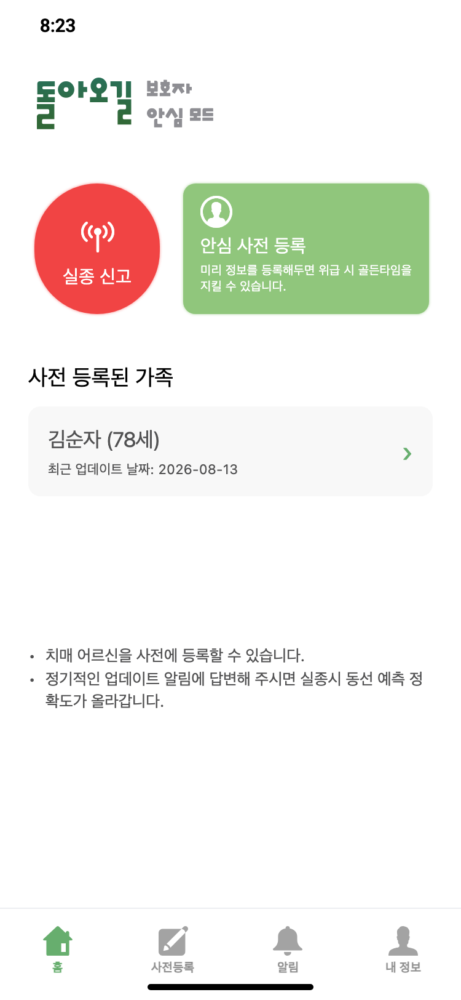
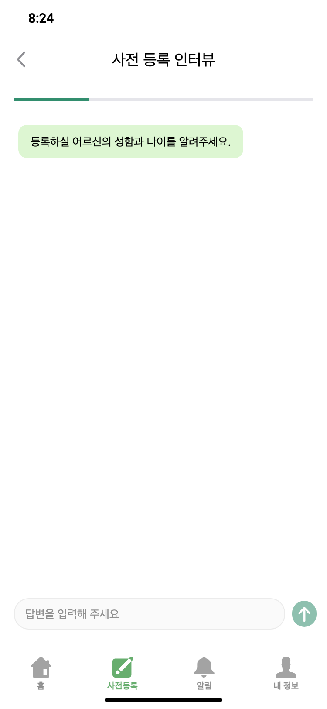
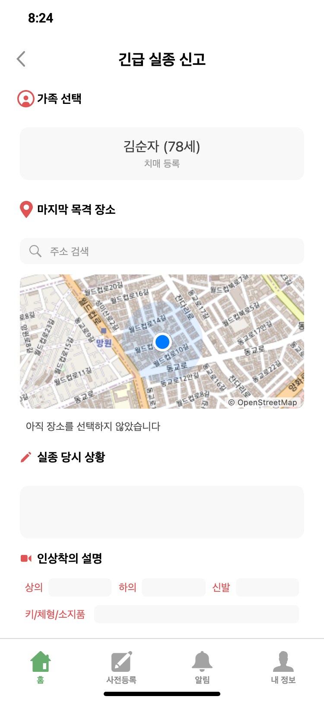
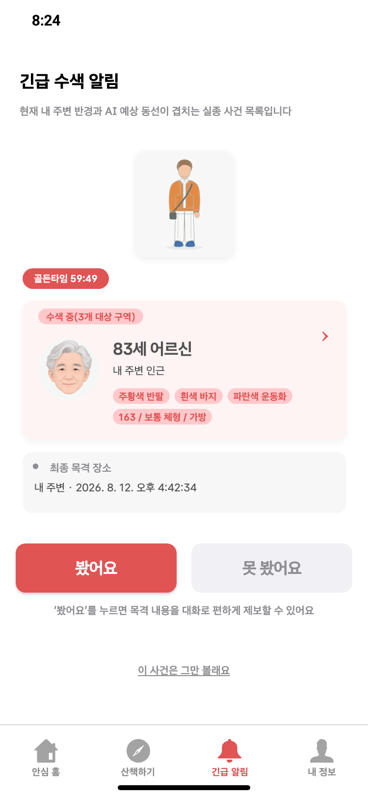
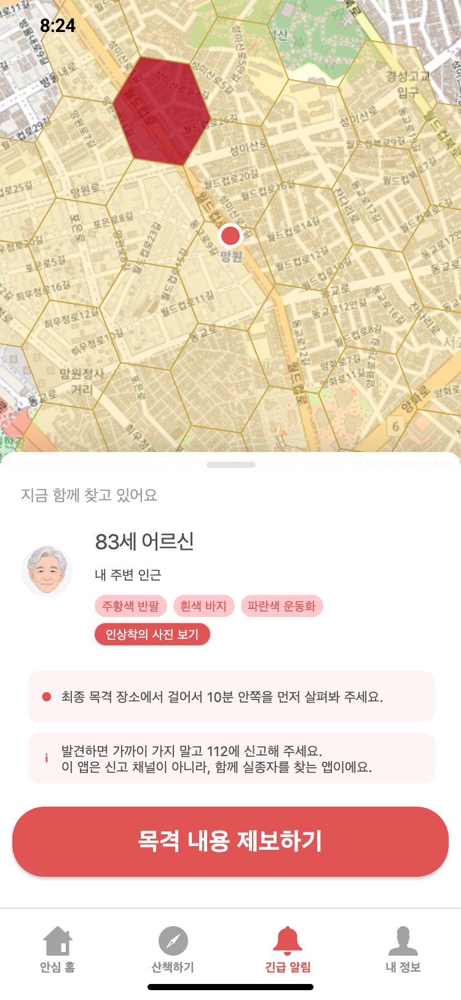
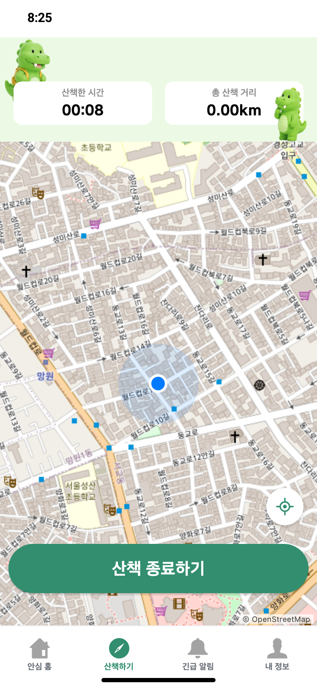
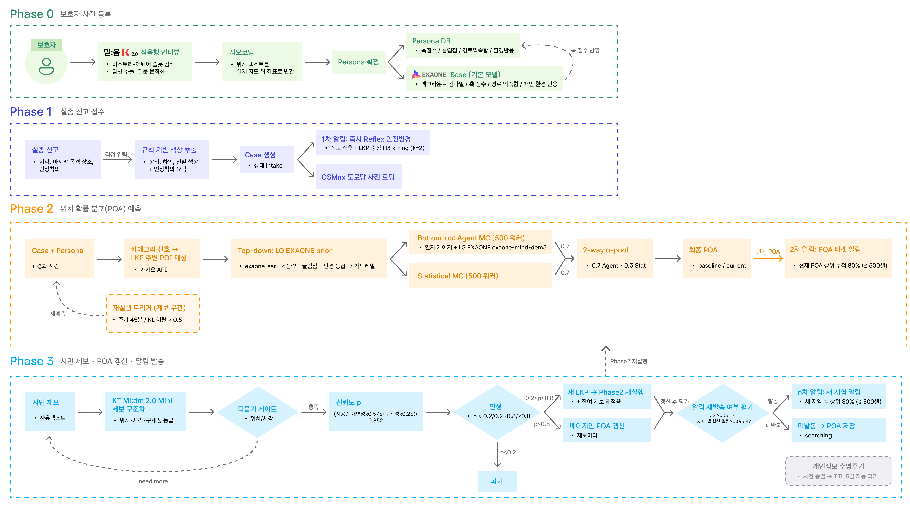

<p align="center">
  
</p>

<h1 align="center">돌아오길</h1>

<p align="center">
  <strong>알림을 피로가 아니라, 내가 해결할 수 있는 일로 바꿉니다.</strong><br>
  AI 기반 동선 예측과 맞춤 알림으로 실종자 수색을 효율화하는 서비스
</p>

2026 인공지능 루키 국내 AI 트랙 본선작입니다. 보호자가 평소에 등록해 둔 생활사와 고전 수색구조(SAR) 통계, 도로망을 결합해 실종자의 위치를 `P(위치 | 경과시간)` 확률 분포로 예측하고, 확률이 높은 최소 구역 안의 시민에게만 알림을 보내 제보를 받습니다. 제보는 다시 확률 지도를 갱신합니다.

경찰청 집계에서 연간 실종 신고는 5만 건을 넘어섰고 그중 약 3분의 1이 치매 환자입니다. 발견의 대부분이 24시간 안에 이뤄지는 만큼 초기 대응이 결정적이지만, 현행 광역 경보는 무관한 사람에게까지 닿아 피로도를 키우고 정작 가까이 있는 사람의 참여를 끌어내지 못합니다.

## 서비스가 해결하는 문제

| 시점 | 현장의 문제 | 돌아오길의 대응 |
|---|---|---|
| 실종 이전 | 정작 필요한 순간에 "어디로 가실 만한 분인지"를 정리해 둔 곳이 없다 | 평소 대화형 등록으로 자주 가는 곳·성향·주의사항을 페르소나로 남긴다 |
| 실종 직후 | 기지국 단위 광역 문자는 관심 밖으로 밀려나 방관자 효과를 만든다 | 도달 가능 반경 전체가 아니라 확률 상위 최소 구역에만 알림을 보낸다 |
| 알림 수신 | 텍스트로 던져진 인상착의는 기억에 남지 않고, 나와 얼마나 가까운지도 알 수 없다 | 내 위치와 예측 구역을 지도에 겹쳐 보여주고, 인상착의를 색 태그와 카드로 정리한다 |
| 수색 중 | 제보가 들어와도 다음 수색 범위에 반영되지 않는다 | 제보 신뢰도를 계산해 확률 지도를 갱신하고, 결정적 제보면 새 기점에서 다시 예측한다 |
| 평상시 | 비상용 앱은 깔리지 않고, 깔려도 지워진다 | 산책 기록·코스 추천을 쓰는 산책 모드로 지내다 경보가 뜨면 수색 모드로 전환한다 |

## 핵심 기능

### 1. 대화형 사전 등록 — 페르소나

- 고정 설문이 아니라 직전 답변의 화제를 보고 다음 질문을 고르는 적응형 인터뷰입니다. 질문 카탈로그는 12개 슬롯(공통 8·치매 특화 4)입니다.
- 다음 슬롯은 코드가 고릅니다. Mi:dm은 답변에서 사실을 뽑고 그 슬롯의 질문을 한 문장으로 만드는 일만 합니다.
- 신고가 급할 때는 Tier 1 5문항만 받는 빠른 등록으로 시작하고, 남은 문항은 홈의 보완 대화에서 채웁니다.
- 장소는 근거 등급(언급만·보호자 관찰·과거 발견지)으로 나누어 저장하고, 지역 표기가 없는 장소는 그 자리에서 되묻습니다. 되묻지 않으면 지오코딩이 실패해 그 장소가 페르소나에서 통째로 사라집니다.
- 확정된 페르소나에서 성향 축 점수·경로 익숙함·개인 환경 반응을 백그라운드로 컴파일합니다.

### 2. AI·알고리즘 하이브리드 동선 예측

- 보호자가 앱에서 신고하면 Case가 만들어지고, 승인 대기 없이 마지막 목격지 중심 19셀에 1차 경보가 나갑니다. 앱은 112를 대체하지 않으며, 이 경보는 재난문자가 아니라 앱 사용자 인앱 알림입니다.
- EXAONE-SAR(지식 LoRA)가 수색 논문 발췌를 참고해 이동 전략 비율·장소 끌림·이동 반경 등급을 만듭니다. 좌표는 만들지 않습니다.
- Koester 로그정규 이탈거리, 6개 이동 전략, OSMnx 보행 도로망 위에서 가상 보행자 500명을 걷게 해 확률 지도를 만듭니다.
- 워커가 귀소·불안 상태에 들어가면 EXAONE-Mind(행동 LoRA)가 그 순간의 목표와 행동을 다시 해석합니다. 실제 호출은 예측당 5회로 묶고, 발동 상황을 5개 층으로 나눠 배분해 희소한 층도 실호출을 받게 합니다.
- 유효 반경은 통계 상한과 물리 상한의 교집합입니다 — `p95 = min(ISRID p95, v_max × 경과시간)`.
- 출력은 선이 아니라 확률 구름입니다. H3 resolution 9 셀별 확률이며 합은 1입니다. 시간이 흐르면 같은 모델을 더 늦은 시점에서 다시 평가해 지도를 갱신합니다.

### 3. 넛지 알림과 시민 제보

- 확률 누적 80%를 덮는 최소 셀(상한 500개)만 알림 대상으로 고릅니다.
- 알림 화면은 남은 골든타임, 지금 함께 찾고 있는 사람 수, 대상 구역 수를 함께 보여줍니다. 텍스트를 읽게 하는 대신 "지금 내가 도울 수 있다"가 먼저 보이게 하는 것이 목적입니다.
- 인상착의는 상의·하의·신발·특징을 각각의 태그로 끊어 보여주고, 보호자가 입력한 옷 색만 반영한 전신 그림을 함께 띄웁니다. **사진은 받지 않습니다** — 자리표시 사진은 아무 상관 없는 사람의 얼굴을 실종자로 읽히게 만들기 때문입니다. 색을 모르는 부위는 추측하지 않고 회색으로 둡니다.
- 제보는 자유 텍스트 한 덩어리로 받아 위치·시각·구체성을 구조화합니다. `30분 전` 같은 상대 시각의 산술은 모델이 아니라 코드가 결정론으로 계산합니다.
- 신뢰도 `p`에 따라 파기(`p < 0.2`) / 확률 지도 갱신 / 새 기점 재예측(`p ≥ 0.8`)으로 갈립니다.
- 재예측으로 새로 생긴 지역이 있을 때만 추가 알림을 보냅니다. 이미 알린 구역에 다시 보내지 않습니다.

### 4. 앱 일상화 — 산책 모드

- 평상시에는 산책 기록과 주변 산책로 추천을 쓰는 산책 모드로 지냅니다. 비상시에만 쓰는 앱은 설치되지 않고, 설치돼도 지워집니다.
- 경보가 뜨면 같은 앱이 수색 모드로 전환됩니다. 모드는 화면이 아니라 전역 상태라 어느 화면에 있든 함께 바뀝니다.
- 산책 기록은 거리·시간 요약만 서버로 보냅니다. 좌표열은 보내지 않습니다.

## 주요 화면

배포본에서 그대로 캡처한 화면입니다. 위 줄이 보호자, 아래 줄이 시민입니다.

| 보호자 홈 | 사전 등록 인터뷰 | 긴급 실종 신고 |
|:---:|:---:|:---:|
|  |  |  |
| 등록된 가족을 확인하고 위급 시 바로 신고합니다 | 고정 설문 대신 대화로 생활사를 수집합니다 | 목격 장소를 지도로 확정하고 인상착의를 받습니다 |

| 긴급 수색 알림 | 예측 구역과 제보 진입 | 산책 모드 |
|:---:|:---:|:---:|
|  |  |  |
| 확률 상위 구역의 시민에게만 도착합니다 | 예측 셀을 지도로 보고 바로 제보로 넘어갑니다 | 평상시엔 산책 앱으로 지내다 경보 시 수색 모드로 전환됩니다 |

## 기술 구조


같은 구조를 Phase 단위 파이프라인으로 보면 다음과 같습니다.



설계 문법은 다음 네 문장으로 요약됩니다.

> 해석은 LLM · 좌표는 알고리즘 · 알림은 최소 구역 · 실패는 폴백

- **역할 분리** — 믿:음은 대화, EXAONE은 성향·마음 판단을 맡고 위치 계산은 전부 결정론 알고리즘입니다. LLM은 좌표도 전역 경로도 만들지 않습니다.
- **모델 분리** — 같은 EXAONE도 prior(지식 LoRA)·마음 재해석(행동 LoRA)·성향 축 채점(기본 모델)으로 나눠 씁니다. 축 채점에 지식 LoRA를 쓰면 골드셋 정확일치가 0.88에서 0.74로 떨어졌습니다.
- **폴백** — 모델·지도 API가 실패해도 통계 기본값, 연속 공간 시뮬레이션, 오프라인 지명 사전으로 파이프라인이 끝까지 돕니다. 폴백이 걸린 예측은 응답 필드로 표시해 화면에 경고를 띄웁니다.
- **영속성과 파기** — 사전 등록은 몇 달 뒤의 실종을 위한 것이라 SQLite에 저장합니다. 대신 종결 5일 뒤 자동 파기하고, 삭제 시 디스크 페이지까지 회수합니다.

### 국내 AI 모델 배치

실종자 정보는 인상착의·병력·거주지를 포함하는 최고 민감도 데이터입니다. 해외 API로 내보내지 않고 국내 모델과 자체 호스팅으로 구성했습니다.

| 단계 | 모델 | 맡는 일 | 맡지 않는 일 |
|---|---|---|---|
| Phase 0 온보딩 | KT Mi:dm 2.0 | 보호자 답변에서 사실 추출, 질문 문장화 | 다음 질문 선택(코드가 한다) |
| Phase 0 슬롯 선택·RAG 검색 | 업스테이지 임베딩 | 미충족 슬롯 랭킹, 논문 발췌 검색 | 실시간 위치 예측 |
| Phase 0 컴파일 | EXAONE 기본 모델 | 성향 축 A~F 채점, 환경 반응 | prior·마음 재해석 |
| Phase 2 prior | EXAONE + `exaone-sar` LoRA | 이동 전략·끌림점·반경 등급 | 좌표·전역 경로 |
| Phase 2 마음 재해석 | EXAONE + `exaone-mind-dem5` LoRA | 게이지 발동 시 목표·행동·혼란 등급 | prior·축 채점 |
| Phase 3 제보 구조화 | KT Mi:dm 2.0 Mini | 시공간 문구 파싱, 구체성 등급 | 좌표 확정, 상대→절대 시각 산술 |

EXAONE은 자체 호스팅 A100에서 vLLM으로 서빙하고 LoRA 어댑터를 갈아 끼워 씁니다. LLM은 어디서도 실수 확률값을 직접 만들지 않습니다 — 정성 등급과 원문 인용 근거만 출력하고, 수치 매핑과 가중치 계산은 코드가 합니다.

자세한 구현은 [docs/IMPLEMENTATION_ARCHITECTURE.md](docs/IMPLEMENTATION_ARCHITECTURE.md), API 계약은 [API_CONTRACT.md](API_CONTRACT.md)를 참고하십시오.

## 측정된 AI

**개인화 예측의 효과 — 사전등록 실험.** 실험 설계·지표·판정 기준을 실행 전에 등록해 사후 조작을 차단한 실험입니다. 같은 실종 사건을 개인 정보 없이 예측한 경우(비개인화)와 사전 등록 정보를 주입해 예측한 경우(개인화)로 나눠, 27개 시나리오·108개 시점에서 짝지어 비교했습니다. 정답 경로는 개인 정보와 독립적으로 생성해 순환논법을 막았습니다.

| 지표 | 비개인화 | 개인화 | 판정 |
|---|---:|---:|---|
| 상위 3셀 확률 질량 | 0.268 | 0.541 | 개인화 108쌍 중 100승, p=2.35e-21 |
| 예측면 셀 수(평균) | 104.0 | 70.5 | 32% 축소 |
| 정답 셀에 준 확률(평균) | 0.047 | 0.084 | 1.8배 |

같은 수의 셀에만 알림을 보낼 때의 적중률은 모든 예산 구간에서 비열등 기준(−5%p 이내)을 충족했습니다.

| 알림 셀 수 | 5 | 10 | 15 | 20 | 25 | 30 |
|---|---:|---:|---:|---:|---:|---:|
| 비개인화 | 40.7% | 54.6% | 64.8% | 69.4% | 77.8% | 82.4% |
| 개인화 | 42.6% | 61.1% | 65.7% | 68.5% | 75.0% | 79.6% |

즉 개인화는 더 잘 맞히는 쪽이 아니라 **같은 정확도를 더 좁은 면적으로** 달성하는 쪽으로 작동합니다 — 알림 대상을 3분의 2로 좁혀도 정확도를 잃지 않습니다. 설계와 전체 수치는 [사전등록 문서](backend/experiments/personalized_alert_replay/PREREGISTRATION_V2.md)와 [결과 보고](backend/experiments/personalized_alert_replay/results/V2_RESULTS.md)에 있습니다.

**마음 모델.** 재학습(dem5) 뒤 학습에 없던 동네에서도 보호자 진술을 근거로 목적지를 추론했습니다(비학습 지역 목표 발화 3/75 → 27/75, 9개 동네). 봉인 평가에서 근거 없는 장소를 지목하는 함정은 8/8 회피했고 목표 적중은 83%입니다.

## 안전장치

사람의 생명과 개인정보가 걸린 시스템이라, 모델을 믿는 대신 코드가 막습니다.

- **환각** — LLM은 등급과 원문 인용만 내고 수치화는 코드가 합니다. 인용이 실제 발화에 없으면 채점을 버리고, 상대 시각의 산술은 결정론 함수가 계산해 `[목격시각, 현재]` 범위 밖이면 폐기합니다. 다만 제보 구조화 모델이 원문에 없는 시각을 만들어 낼 수 있고 이를 원문과 대조하는 가드는 아직 없습니다.
- **편향** — 개인화를 허용하는 게이지 계수는 허용·금지 목록으로 코드에 못박혀 있고 테스트가 그 목록을 강제합니다. hazard 곡선과 게이지 교차항은 개인화하지 않습니다. 사람마다 다른 좌표계가 생기거나 같은 특성이 두 번 반영되는 것을 막기 위해서입니다.
- **프라이버시** — 주민등록번호·전화번호는 저장과 프롬프트 전달 전에 마스킹합니다. 시민 열람 집계는 클라이언트가 만든 불투명 난수만 받고 좌표를 수집하지 않으며, 기기 위치는 폰이 해상도를 낮춰 보낸 값만 현재분으로 덮어씁니다. 종결 케이스는 5일 뒤 파기하고 감사로그에는 ID·행위·사유 코드만 남습니다.
- **악용** — 제보는 시공간 개연성으로 신뢰도를 계산해 낮으면 저장 없이 버립니다. 장소 표현이 아예 없는 제보는 그 자리에서 되묻습니다. 장소 표현이 있어도 좌표를 얻지 못하면 제보 기록은 남되 확률 지도에는 반영하지 않습니다 — 좌표 없는 제보는 지도를 기울일 수 없습니다. 인상착의에 사진을 쓰지 않는 것도 오인 지목을 만들지 않기 위한 선택입니다.

## 기술 스택

| 영역 | 기술 |
|---|---|
| 모바일·웹 | Expo SDK 57, React Native 0.86, React 19, TypeScript strict |
| API | FastAPI, Pydantic v2 |
| 데이터 | SQLite (영속 저장·안전 삭제) |
| 공간 계산 | H3 resolution 9, OSMnx 보행 도로망, 환경부 EGIS 토지피복 |
| 자체 호스팅 모델 | vLLM · A100 — EXAONE + LoRA 3종 (SAR · Mind · Base) |
| 외부 AI API | KT Mi:dm 2.0 (온보딩·제보 구조화), Upstage embedding (의미 검색) |
| 지도·위치 | Kakao Local, Nominatim, OSM Overpass |
| 배포 | Docker, nginx, Cloudflare Tunnel |
| 품질 | pytest 892건, 관제 대시보드 기반 E2E |

## 저장소 구조

```text
Come-back-home/
├── backend/
│   ├── app/
│   │   ├── api/          Phase 0~3 · 산책 · 인증 · 지도 · 개인정보 · 디버그 라우터
│   │   ├── phase0/       적응형 온보딩과 Persona 컴파일
│   │   ├── phase1/       신고 접수와 1차 경보
│   │   ├── phase2/       prior · 인지 게이지 · 몬테카를로 · POA 결합
│   │   ├── phase3/       제보 신뢰도 · POA 갱신 · 재예측 · 알림
│   │   ├── geo/          H3 · 지오코딩 · POI · 도로망 · 환경 레이어
│   │   ├── llm/          Mi:dm · EXAONE · 제보 구조화 클라이언트와 폴백
│   │   ├── privacy/      종결 · TTL · 파기 · 감사로그
│   │   └── storage.py    SQLite 영속 저장소
│   ├── experiments/      골드셋 · 발견율 곡선 · 알림 실험 하네스와 결과
│   └── tests/
├── frontend/             Expo React Native 앱 (시민·보호자)
├── dashboard/            경찰 관제 웹 콘솔 (Vite · React)
├── docs/                 구현 아키텍처 · 시연 전 점검
└── API_CONTRACT.md       front ↔ back 계약
```

## 실행

### 1. 백엔드

```bash
cd backend
python -m venv .venv
source .venv/bin/activate
pip install -r requirements.txt
cp .env.example .env
uvicorn app.main:app --reload
```

API는 `http://localhost:8000`, Swagger는 `/docs`입니다. 모델 키가 없어도 통계 기본값과 스텁으로 전체 파이프라인이 돕니다. 부팅 시 데모 케이스 `case-jeongneung-001`이 자동 생성됩니다.

### 2. 프론트엔드

```bash
cd frontend
npm ci
npm start
```

실기기에서는 `localhost`로 백엔드에 닿지 않습니다. `frontend/.env`의 `EXPO_PUBLIC_API_BASE`에 호스트 주소를 넣으십시오.

### 3. 관제 대시보드

```bash
cd dashboard
npm install
npm run dev
```

## 검증

```bash
cd backend
python -m pytest -q
```

시연 전 점검(도로망 예열·모델 폴백 확인)은 [docs/DEMO_PREFLIGHT.md](docs/DEMO_PREFLIGHT.md)를 따르십시오.

## 팀

서강대학교 팀 동행 — 2026 인공지능 루키 국내 AI 트랙

| 역할 | 구성원 |
|---|---|
| 개발 | 김민아 · 방서영 · 조대흠 |
| 기획·디자인 | 이수빈 · 이지영 · 한민영 |
