# 돌아오길 develop 구현·아키텍처 현황

> 기준 브랜치: `origin/develop`
>
> 기준 커밋: [`f1286f4`](https://github.com/Donghaeng-AI-ROOKIE/Come-back-home/commit/f1286f4) (`2026-07-21`, PR #56 병합)
>
> 조사 방식: API 라우터, 도메인 스키마, Phase별 서비스 모듈, 프런트엔드 클라이언트와 테스트 코드를 정적 추적
>
> 주의: 이 문서는 기획 설계가 아니라 **현재 코드가 실제로 수행하는 동작**을 기준으로 작성한다. 스텁, 기능 플래그 비활성, 미배선 기능은 별도로 표시한다.

## 1. 결론 요약

현재 develop은 `Persona → MissingReport/Case → 위치 확률 분포(POA) → 타겟 알림·제보 갱신`의 전체 백엔드 흐름을 구현하고 있다. 핵심 위치 분포는 H3 셀 확률로 표현하며, LLM은 좌표를 생성하지 않고 제한된 구조화 판단만 제공한다.

| 영역 | 현재 수준 | 핵심 판정 |
|---|---|---|
| Phase 0 보호자 온보딩 | 구현, 일부 기능 플래그 | 백엔드 적응형 인터뷰·지오코딩·Persona 확정 구현. 축 점수·경로 익숙함 컴파일은 기본 비활성 |
| Phase 1 실종 신고 | 백본 구현 | Case 생성, 선택적 인상착의·문서 추출 경로, 즉시 안전반경 알림, 도로망 사전 로딩 구현. 파일 입력과 외부 추출 모델은 스텁 |
| Phase 2 위치 예측 | 알고리즘 파이프라인 구현 | EXAONE prior, Koester, 6전략, H3, 500 워커 MC, 조건부 OSMnx, 인지 게이지, 2-way 결합 구현 |
| Phase 3 알림·제보 | 로직 구현, 외부 발송 미연동 | POA 타겟 셀, 신뢰도 `p`, 층1 갱신, 층2 재실행, D3 새 지역 알림 구현. FCM·사용자 위치 인덱스는 스텁 |
| 개인정보 수명주기 | 백본 구현 | 종결·TTL·명시 삭제·연쇄 파기·감사로그 구현. 실제 서비스 DB가 아닌 인메모리 저장소 |
| 프런트엔드 | 목 중심 UI 구현 | 3역할·2모드·11개 화면과 POA 조회 일부 배선. Phase 0·3 챗봇은 백엔드 챗봇과 별개의 로컬 고정 흐름 |

가장 중요한 현재 경계는 다음과 같다.

1. 백엔드 Phase 0 챗봇은 실제 적응형 슬롯 인터뷰이지만 프런트 등록 화면은 이를 호출하지 않는다.
2. Phase 2의 도로망·환경·스텝별 인지 게이지는 `USE_ROADNET=true`일 때만 활성화된다. 기본값은 `false`이다.
3. Agent MC와 Statistical MC는 모두 500 워커지만 동일한 EXAONE prior를 공유한다. 따라서 Statistical MC는 “동적 마음 재해석 제외 비교군”이지 완전한 비-AI 비교군은 아니다.
4. 알림 대상 셀 계산은 구현됐지만 실제 푸시 발송과 셀 내 사용자 조회는 구현되지 않았다.
5. 프런트 기본값은 `USE_MOCK=true`이고, 실백엔드 제보 응답 매핑은 아직 예외를 발생시킨다.

## 2. 전체 시스템 아키텍처

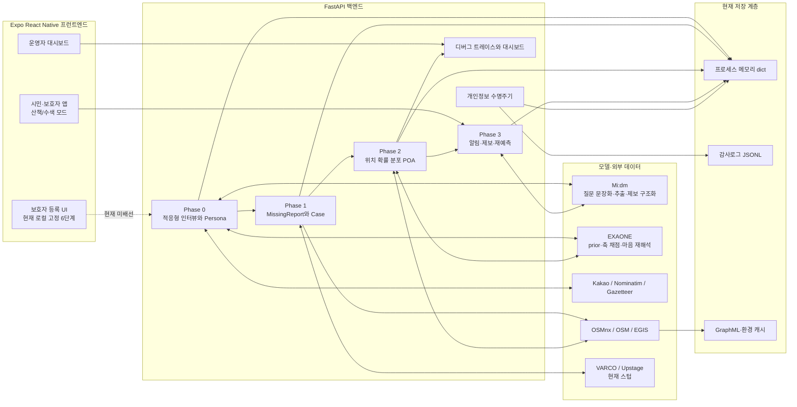

### Phase 간 중심 데이터


| 객체 | 생성 Phase | 주요 내용 | 다음 소비자 |
|---|---|---|---|
| `InterviewSession` | 0 | 대화, 충족·소진 슬롯, Persona 초안, LLM 장애 상태 | Phase 0 확정 로직 |
| `Persona` | 0 | 기본정보, 집, 끌림점, 선호 카테고리, 행동 근거, 축 점수, 경로 익숙함 | Phase 1·2 |
| `MissingReport` | 1 | 실종 유형, 최초 LKP·시각, 인상착의, 신고자 | `Case` |
| `Case` | 1 | 현재 LKP, 상태, prior, baseline/current POA, 제보, 마지막 알림 스냅샷 | Phase 2·3·개인정보 모듈 |
| `PriorParams` | 2 | 6전략 확률, 끌림점 가중치, Koester 로그정규 파라미터 | Top-down·두 MC |
| `POA` | 2 | H3 셀별 확률, 합 1 | 지도·알림·제보 갱신 |
| `Tip` | 3 | 원문, 위치, 시각, 신뢰도 `p`, 판정 | 층1 갱신·층2 재실행 |

## 3. 기술 스택과 저장 구조

| 계층 | 구현 |
|---|---|
| 백엔드 | Python, FastAPI, Pydantic v2 |
| 공간 모델 | H3 resolution 9, OSMnx 보행 그래프, OSM 환경 객체, EGIS WMS |
| 프런트엔드 | Expo SDK 57, React Native 0.86, React 19, TypeScript strict |
| 프런트 상태 | Zustand, TanStack Query, React Navigation v7 |
| LLM 연동 규약 | Mi:dm·EXAONE 모두 OpenAI 호환 `chat/completions` |
| 현재 영속성 | Persona·Case·Interview 등은 프로세스 메모리 `dict`; 감사로그만 JSONL append-only |
| 데모 | 서버 시작 시 `case-jeongneung-001` 시드, `/dashboard` 정적 E2E 대시보드 |

백엔드 저장소는 [`backend/app/storage.py`](../backend/app/storage.py)의 제네릭 `Repository`이다. 서버 재시작 시 Persona·Case·Tip·트레이스는 사라진다. 도로망·환경 데이터는 별도 디스크 캐시를 사용할 수 있다.

---

## 4. Phase 0 — 보호자 사전 온보딩

### 4.1 목적과 입출력

| 구분 | 내용 |
|---|---|
| 입력 | 보호자 이름, 선택적 대상자 유형, 보호자 자유발화 |
| 핵심 처리 | 슬롯 기반 적응형 인터뷰, 답변 추출, 질문 선택·문장화, 확인 게이트, 지오코딩 |
| 출력 | 확정 `Persona` |
| 주요 파일 | [`interview.py`](../backend/app/phase0/interview.py), [`slots.py`](../backend/app/phase0/slots.py), [`retrieval.py`](../backend/app/phase0/retrieval.py), [`prompts.py`](../backend/app/phase0/prompts.py), [`safety.py`](../backend/app/phase0/safety.py) |

### 4.2 Phase 0 아키텍처

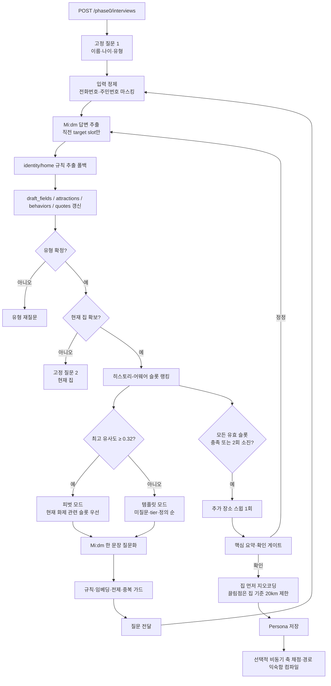

### 4.3 챗봇의 실제 책임 분리

Phase 0은 “Mi:dm이 대화 전체를 자율 진행”하는 구조가 아니다. 다음 질문의 **대상 슬롯은 코드와 임베딩 검색이 선택**하고, Mi:dm은 선택된 슬롯 안에서만 동작한다.

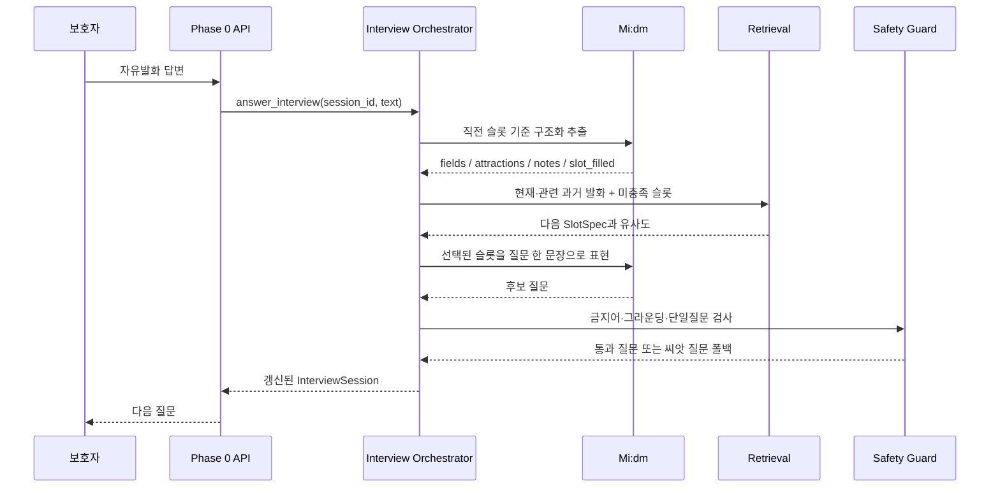

#### 슬롯 카탈로그

- 전체 16개 슬롯이다.
- 공통 8개, 치매 특화 4개, 발달장애 특화 4개이다.
- 지원 Persona 유형은 치매와 지적장애 두 종류이며, 아동 Persona는 PR #47에서 제거됐다.
- 각 슬롯은 `axis`, `axis_field`, `tier`, `sink`, `question`, `probes`, `filled_when`, `why`, `keywords`, `risk`, `answer_example`을 가진다.
- 저장 대상은 기본 필드, 좌표화할 끌림점, 행동·축 근거로 구분한다.

#### 질문 선택 알고리즘

1. 최신 사용자 답변을 앵커로 사용한다.
2. 앵커와 코사인 유사도 `0.15` 미만인 과거 턴은 검색 문맥에서 제거한다.
3. 유효하며 충족·소진되지 않은 슬롯과 검색 쿼리의 유사도를 계산한다.
4. 최고 유사도가 `0.32` 이상이면 피벗 모드로 전환한다.
5. 피벗 점수는 다음 구성이다.

```text
score = similarity + tier_bonus + gated_risk - asked_penalty
```

6. 강한 관련 신호가 없으면 덜 질문한 슬롯, 낮은 tier, 정의 순서로 진행한다.
7. 슬롯별 최대 2회, 전체 질문 최대 40개로 무한 반복을 차단한다.

#### 답변 저장과 안전장치

- 주민등록번호와 전화번호 패턴은 저장·프롬프트 전달 전에 마스킹한다.
- 이름·나이·집은 Mi:dm 장애 시 정규식 기반 최소 추출을 수행한다.
- “모르겠다”는 해당 슬롯을 즉시 소진하고, 짧은 부정 답변은 “해당 없음”으로 충족 처리한다.
- 질문은 의료·법률·위해 금지어, 슬롯 비연관성, 한 번에 여러 질문, 근거 없는 전제, 과거 중복을 검사한다.
- 추출 노트는 원발화와 토큰이 겹치지 않으면 환각 가능성이 있는 것으로 보고 버린다.
- 원발화는 `axis_quotes`, Mi:dm 재서술은 `axis_evidence`로 분리 보존한다.
- 확인 게이트의 정정 발화는 `first-wins`를 예외적으로 덮어쓴다.
- 집 지오코딩 실패 시 세션을 종료하지 않고 집 재질문으로 복귀한다.

### 4.4 Persona 확정과 지오코딩

지오코딩은 `Kakao Local → Nominatim → 오프라인 Gazetteer` 체인이다.

1. 현재 집을 먼저 좌표화한다. 집이 없거나 실패하면 Persona를 만들지 않는다.
2. 끌림점은 집 좌표를 앵커로 검색하며 20km 밖 결과는 오검색으로 간주한다.
3. 결과 정밀도는 `poi > address > dong > approx > unknown` 순으로 관리한다.
4. 같은 장소가 다시 언급되면 근거를 `mention_only → caregiver_report → previous_missing_found` 방향으로만 승격한다.
5. “지하철”, “자동문”처럼 특정 좌표가 아닌 선호는 `preferred_targets`로 저장하고 Phase 2에서 LKP 주변 POI와 매칭한다.

### 4.5 축 점수와 경로 익숙함 컴파일

이 경로는 `AXIS_SCORING_ENABLED=true`일 때만 실행되며 기본값은 `false`이다.

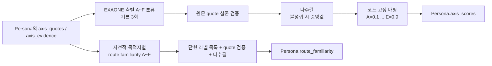

- 치매는 기준표가 있는 6개 축, 발달장애는 7개 축을 채점한다.
- `F` 또는 근거 없음은 0점이 아니라 **키 부재**로 저장해 Phase 2 기본값 폴백을 허용한다.
- 축 채점은 기본 비동기이며 진행·완료·오류·스텁 상태와 stale 재시도 마커를 관리한다.
- 경로 익숙함은 `autobiographical_destination_pull`에서 생긴 끌림점만 채점한다.
- `routine_destinations`는 보호자가 자주 간다고 확인한 장소이므로 Phase 2에서 기본 익숙함 `0.8`을 사용한다.

### 4.6 API와 현재 제한

| 메서드 | 경로 | 구현 |
|---|---|---|
| `POST` | `/phase0/interviews` | 세션 시작 |
| `POST` | `/phase0/interviews/{id}/answers` | 답변 반영·다음 질문 |
| `GET` | `/phase0/interviews/{id}` | 대화 전문 포함 세션 조회 |
| `GET` | `/phase0/slots` | 슬롯 카탈로그 조회 |
| `POST` | `/phase0/personas` | 구조화 필드 직접 등록 |
| `GET` | `/phase0/personas/{id}` | Persona 조회, 원발화 `axis_quotes`는 응답 제외 |

현재 제한:

- 프런트 [`RegChatScreen.tsx`](../frontend/src/screens/RegChatScreen.tsx)는 백엔드 Phase 0 API가 아니라 로컬 6단계 스크립트를 사용한다.
- 직접 등록 API는 인터뷰의 축 근거·선호 카테고리·경로 익숙함 생성 흐름을 거치지 않는다.
- 기본 로컬 임베더는 `jhgan/ko-sroberta-multitask`이며 최초 실행 시 모델 준비가 필요하다. 모델명을 비우면 의미 임베딩이 아닌 해시 어휘 중첩으로 폴백한다.

---

## 5. Phase 1 — 실종 신고 접수

### 5.1 목적과 입출력

| 구분 | 내용 |
|---|---|
| 입력 | 유형, LKP 좌표, LKP 시각, 선택적 Persona ID, 사진·문서 유무 플래그 |
| 핵심 처리 | 신고 구조화, Case 생성, 축 채점 백필, 즉시 안전반경 알림, 선택적 도로망 사전 로딩 |
| 출력 | 상태가 `intake`인 `Case` |
| 주요 파일 | [`phase1/intake.py`](../backend/app/phase1/intake.py), [`api/phase1.py`](../backend/app/api/phase1.py), [`schemas/report.py`](../backend/app/schemas/report.py) |

### 5.2 Phase 1 아키텍처

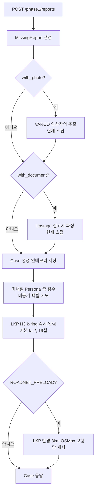

외부 모델, 축 채점, 즉시 알림, 도로망 로딩은 모두 실패를 격리한다. 어느 하나가 실패해도 신고 접수 자체는 계속된다.

### 5.3 구현 세부사항

- 최초 `MissingReport.lkp`와 `lkp_time`을 `Case`의 현재 앵커로 복사한다.
- 시각 입력은 API 입구에서 프로젝트 기준인 로컬 naive datetime으로 정규화한다.
- Persona가 연결됐으나 축 점수가 비어 있고 근거가 있으면 백그라운드 채점을 다시 시도한다.
- `REFLEX_ALERT_ON_INTAKE=true`가 기본이며 POA 없이도 LKP 중심 H3 `k=2` 안전반경을 선택한다.
- `ROADNET_PRELOAD=false`가 기본이다. 활성화하면 Phase 2 전에 3km 보행망을 캐시한다.

### 5.4 API와 현재 제한

| 메서드 | 경로 | 구현 |
|---|---|---|
| `POST` | `/phase1/reports` | 신고 접수·Case 생성 |
| `GET` | `/phase1/cases/{id}` | Case 조회 |

현재 제한:

- 실제 multipart 파일 업로드가 아니라 `with_photo`, `with_document` 불리언만 받는다.
- VARCO와 Upstage 클라이언트는 항상 결정적 스텁 값을 반환한다.
- 즉시 알림은 대상 셀 계산까지만 실제이며 푸시 발송은 하지 않는다.
- Persona ID의 존재 여부나 신고 유형과 Persona 유형의 일치 여부를 API에서 강제하지 않는다.

---

## 6. Phase 2 — 위치 확률 분포 예측

### 6.1 목적과 입출력

| 구분 | 내용 |
|---|---|
| 입력 | `Case`, 연결된 `Persona`, 현재 시각 또는 재현용 seed |
| 핵심 처리 | EXAONE prior, 가드레일, Top-down, Agent MC, Statistical MC, 2-way α-pool |
| 출력 | 네 POA 레이어와 최종 `baseline_poa/current_poa` |
| 주요 파일 | [`pipeline.py`](../backend/app/phase2/pipeline.py), [`simulation.py`](../backend/app/phase2/simulation.py), [`guardrail.py`](../backend/app/phase2/guardrail.py), [`gauges.py`](../backend/app/phase2/gauges.py) |

### 6.2 Phase 2 전체 아키텍처

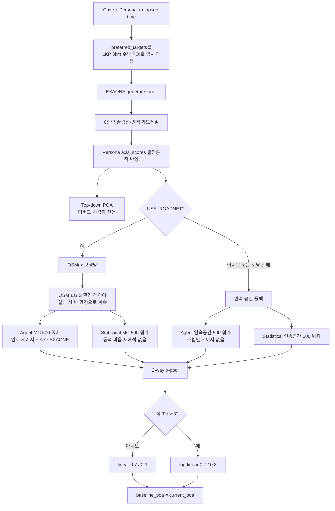

### 6.3 1단계: 카테고리 선호를 실제 POI로 변환

`preferred_targets`는 “지하철”, “편의점”처럼 좌표가 없는 선호이다. 예측 시 Kakao Local에서 LKP 반경 3km, 선호당 최대 3곳을 검색해 Persona 사본의 끌림점으로 합친다. 저장된 Persona는 바꾸지 않으므로 새 LKP 재실행 때 다시 검색한다. 키·검색 실패 시 기존 끌림점만 사용한다.

### 6.4 2단계: EXAONE prior와 가드레일

EXAONE 출력은 좌표가 아니라 다음 `PriorParams`이다.

| 필드 | 모델 출력 | 코드 검증·수치화 |
|---|---|---|
| `strategy_probs` | 6전략 확률 | 알려진 전략만 유지, 각 전략 최소 `0.02`, 재정규화 |
| `attraction_levels` | 끌림점별 상·중·하 | `3:2:1` 매핑, 미등록 라벨 제거, 한 장소 최대 60% |
| `radius_level` | 상·중·하 | Koester `mu`만 `+0.4/0/-0.4`, `sigma` 고정 |
| `reasoning` | 한국어 근거 | 최대 500자 |

축 점수가 있으면 prior 위에 다시 반영한다.

- `mobility_transport_capacity`: 반경 등급을 결정론적으로 재계산한다.
- 발달장애 `elopement_pattern_consistency`: 전략 분포를 더 뾰족하거나 평평하게 만든다.
- 치매 `autobiographical_destination_pull`, 발달장애 `preferred_target_seeking`: 끌림점 분포의 sharpness를 조정한다.
- 마음 취약성 축은 마음 재해석 프롬프트의 자연어 문맥으로 전달된다.

EXAONE 미설정·실패 시 유형별 Koester·6전략 기본값으로 폴백한다. 현재 코드에서 치매 Koester는 Urban 분위수에 맞춘 `mu=0.095`, `sigma=1.48`이다. 지적장애 파라미터는 코드 주석상 추가 검증 대상이다.

### 6.5 3단계: 예측기 3종

#### A. Top-down POA

- Koester 로그정규 분포로 LKP 중심 거리 링을 만든다.
- 경과시간 `√t` 스케일은 폐기했다(PR #52). ISRID 거리가 이미 발견 시점 거리를 모은 종국 분포라 이중계상이었고, 실제로 `t=15분`에 12.55km처럼 도보 한계(1.12km)를 11배 넘는 반경이 나왔다.
- 탐색 원판은 `min(로그정규 p95, v_max × 경과시간)`까지 생성한다 — 통계 상한과 물리 도달 상한의 교집합(`phase2/radius.py`). 세 예측기가 같은 경계를 공유한다.
- 끌림점은 300m 가우시안 범프로 더한다.
- 응답의 `poa_topdown`에는 포함하지만 최종 분포에는 합치지 않는다. 동일 prior가 두 MC에 이미 들어가므로 중복 반영을 피하기 위한 결정이다.

#### B. Agent Monte Carlo

- 기본 500 워커이다.
- 각 워커는 prior에서 6전략 하나를 확률적으로 샘플링한다.
- Koester 샘플은 이동 경로 길이가 아니라 LKP 대비 직선 이탈거리 종료 기준이다.
- 도로망 모드에서는 이웃 노드 선택 확률이 `exp(kappa × cos(bearing difference))`에 비례한다.
- 혼란도가 높을수록 `kappa`가 낮아져 갈림길 선택이 무작위에 가까워진다.
- 종료 조건은 끌림점 도달, 이탈거리 소진, 막다른 길, 최대 300스텝이다.

도로망 모드의 인지 게이지는 다음과 같다.

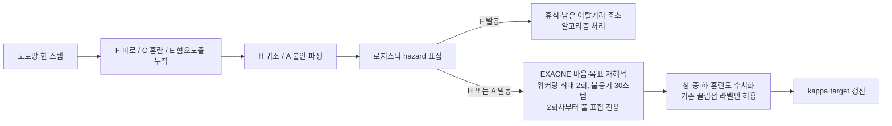

실제 EXAONE 마음 호출은 예측당 최대 10회이다. 이후 발동은 앞선 결과 풀에서 독립 표집한다. 풀도 비어 있으면 혼란도 `+0.2` 휴리스틱을 사용한다.

`route_familiarity`가 있으면 목표 경로의 낯섦도를 `1 - familiarity`로 계산한다. 자주 가는 목적지는 `0.8`, 그 외에는 현재 위치와 익숙한 장소의 거리 기반 근사로 폴백한다.

#### C. Statistical Monte Carlo

- 기본 500 워커이다.
- 같은 Koester 거리, 6전략 prior, 도로망을 사용한다.
- 워커 이동 중 인지 게이지에 의한 EXAONE 마음 재해석은 수행하지 않는다.
- 그러나 파이프라인 앞단의 **동일한 EXAONE prior는 공유**한다. 완전한 비-AI 통계 베이스라인은 아니다.

### 6.6 4단계: 분포 결합과 Case 저장

```text
final POA = 0.7 × Agent MC + 0.3 × Statistical MC
```

- Tip이 3건 미만이면 linear pool로 어느 한쪽이 지지한 지역도 보존한다.
- Tip이 3건 이상이면 log-linear pool로 두 분포가 함께 지지한 지역에 집중한다.
- 결과를 `baseline_poa`와 `current_poa`에 동시에 저장하고 Case 상태를 `predicted`로 바꾼다.

### 6.7 API와 현재 제한

| 메서드 | 경로 | 구현 |
|---|---|---|
| `POST` | `/phase2/cases/{id}/predict?seed=` | 3종 POA 계산, 2-way 최종 결합 |

현재 제한:

- `USE_ROADNET=false`가 기본이라 기본 실행은 연속 공간 폴백이다.
- 연속 공간 폴백은 20스텝 이동만 수행하며 도로·환경·F/C/E/H/A 게이지·희소 EXAONE 마음 재해석을 실행하지 않는다.
- OSM·EGIS·Kakao 호출은 네트워크와 캐시 상태에 영향을 받는다.
- 게이지 계수와 일부 유형별 SAR prior는 잠정값이다.
- 최종 결합 가중치 `0.7/0.3`은 설정 파일이 아니라 파이프라인 코드에 고정돼 있다.

---

## 7. Phase 3 — 알림·시민 제보·POA 갱신

### 7.1 목적과 입출력

| 구분 | 내용 |
|---|---|
| 입력 | 현재 POA, 시민 제보 텍스트·선택적 위치·시각 |
| 핵심 처리 | 알림 셀 선택, 제보 구조화, 신뢰도 계산, 층1 갱신, 층2 재실행, D3 새 지역 알림 |
| 출력 | 갱신된 `current_poa`, `Tip`, 알림 대상 셀 |
| 주요 파일 | [`tip_flow.py`](../backend/app/phase3/tip_flow.py), [`trust.py`](../backend/app/phase3/trust.py), [`poa_update.py`](../backend/app/phase3/poa_update.py), [`alerts.py`](../backend/app/phase3/alerts.py), [`triggers.py`](../backend/app/phase3/triggers.py) |

### 7.2 알림 경로 3종

| 경로 | 시점 | 선택 방식 | 현재 발송 상태 |
|---|---|---|---|
| Reflex | 신고 직후 | LKP 중심 H3 k-ring, 기본 `k=2` | 셀 계산 구현, 푸시 스텁 |
| POA 타겟 알림 | Phase 2 후 수동 API 호출 | 확률 내림차순 누적 80%, 최대 500셀 | 셀 계산 구현, 푸시 스텁 |
| D3 새 지역 알림 | 제보 처리 후 조건 충족 | 마지막 알림 POA에 없던 셀의 합산 질량·커버리지 | 자동 판정 구현, 푸시 스텁 |

POA 타겟 알림 API를 호출하면 그 시점 분포를 `last_alert_poa`로 저장한다. D3는 이 기준이 있어야 “새 지역”을 판단하므로 최초 POA 알림이 없으면 비활성이다.

### 7.3 시민 제보 처리 아키텍처

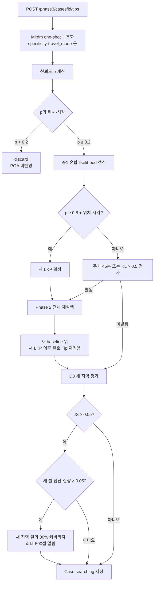

### 7.4 신뢰도 `p`

현재 신뢰도는 두 항의 가중평균이다.

| 항 | 계산 | 기본 가중치 |
|---|---|---|
| 시공간 개연성 | 유형별 최대속도 × 경과시간 도달권, 초과 시 감쇠 | 0.40 |
| 구체성 | Mi:dm `상/중/하` → `0.9/0.6/0.3` | 0.25 |

없는 신호는 제외하고 남은 가중치만 재정규화한다. 아무 신호도 없으면 사전값 `0.3`을 사용한다. 대중교통 단서가 있으면 최대속도를 25km/h로 올린다. 시민 제보 사진 대조는 코드에서 제거됐다.

Phase 3의 Mi:dm 모듈에는 “위치 → 시각 → 인상착의 → 방향 → 조건부 이동수단” 질문 순서를 반환하는 헬퍼가 있지만, 현재 REST API는 다중 턴 제보 세션을 제공하지 않는다. API에서는 제보 텍스트 한 건을 받아 한 번 구조화한다.

### 7.5 층1과 층2

층1은 제보 신뢰도를 이진 통과값으로 바꾸지 않고 그대로 사용한다.

```text
posterior(cell) ∝ current_poa(cell) × [p × L(tip | cell) + (1 - p) × 1]
```

- 위치 없는 제보는 `p` 판정과 기록은 가능하지만 POA를 기울일 수 없다.
- `p ≥ 0.8`이어도 위치·시각이 모두 없으면 새 LKP 자격이 없어 층1로 남는다.
- 층2는 제보 위치·시각을 새 LKP로 교체하고 Phase 2 전체를 다시 실행한다.
- 재실행 뒤 새 LKP 시각 이후의 유효 제보를 새 baseline 위에 다시 적용한다.

### 7.6 D3 새 지역 판정

1. 현재 POA와 `last_alert_poa`의 Jensen–Shannon divergence로 전체 변화량을 예비 검사한다.
2. 마지막 알림 POA에 없고 현재 POA에 생긴 H3 셀의 집합차를 구한다.
3. 새 셀 전체의 확률 질량이 기본 5% 이상일 때만 알림 가치가 있다고 판단한다.
4. 새 지역 내부 확률의 80%를 덮는 셀을 최대 500개까지 선택한다.
5. 발송 경로를 호출한 뒤 `last_alert_poa`를 현재 분포로 갱신한다.

### 7.7 API와 현재 제한

| 메서드 | 경로 | 구현 |
|---|---|---|
| `POST` | `/phase3/cases/{id}/reflex-alerts` | 즉시 안전반경 수동 재호출 |
| `POST` | `/phase3/cases/{id}/alerts` | POA 타겟 셀 선택, D3 기준 시딩 |
| `POST` | `/phase3/cases/{id}/tips` | 제보 판정·갱신·조건부 재실행 |
| `GET` | `/phase3/cases/{id}/poa?top=` | 상위 H3 셀과 육각형 폴리곤 |
| `GET` | `/phase3/cases/{id}/rerun-check` | 주기·KL 재실행 조건 조회 |

현재 제한:

- `send_alerts`는 FCM·APNs·사용자 위치 인덱스를 호출하지 않고 `sent=false`를 반환한다.
- 주기·KL 재실행은 별도 스케줄러가 자동 호출하지 않는다. 제보 흐름에서 검사하거나 조회 API로 상태만 확인한다.
- 프런트 제보 화면은 로컬 고정 4단계이며 백엔드의 `Tip` 응답을 `TipResult`로 변환하는 코드가 없어 실모드에서 의도적으로 예외를 낸다.

---

## 8. 챗봇 아키텍처 비교

현재 저장소에는 이름이 비슷하지만 서로 배선 상태가 다른 세 챗봇 흐름이 있다.

| 흐름 | 질문 선택 | LLM 역할 | API 배선 | 프런트 배선 |
|---|---|---|---|---|
| 보호자 온보딩 백엔드 | 임베딩 검색 + 슬롯 상태 | 답변 추출·선택 슬롯 문장화 | 다중 턴 세션 구현 | 미배선 |
| 시민 제보 백엔드 | 고정 순서 헬퍼는 있으나 세션 API 없음 | 제보 한 건 구조화·구체성 등급 | 단일 `POST /tips` | 텍스트·위치·시각 전송 가능, 응답 매핑 미구현 |
| 프런트 로컬 UI | Phase 0 고정 6단계, Phase 3 고정 4단계 | 없음 | 목 모드 중심 | 구현 |

따라서 시연 화면에서 보이는 챗봇 경험과 백엔드 적응형 챗봇의 실제 동작은 현재 동일한 시스템이 아니다. 실제 통합 시 다음 연결이 필요하다.

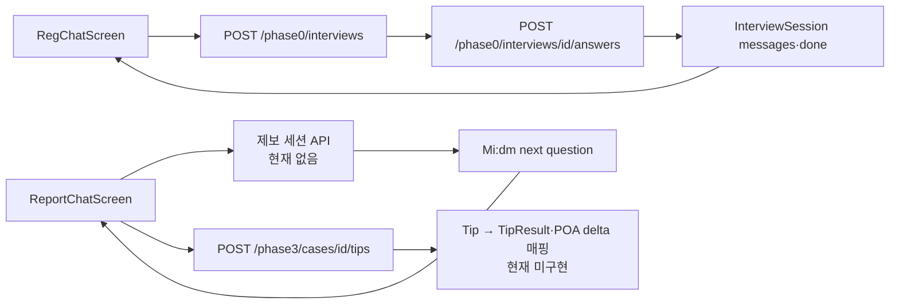

## 9. 프런트엔드 구현 구조

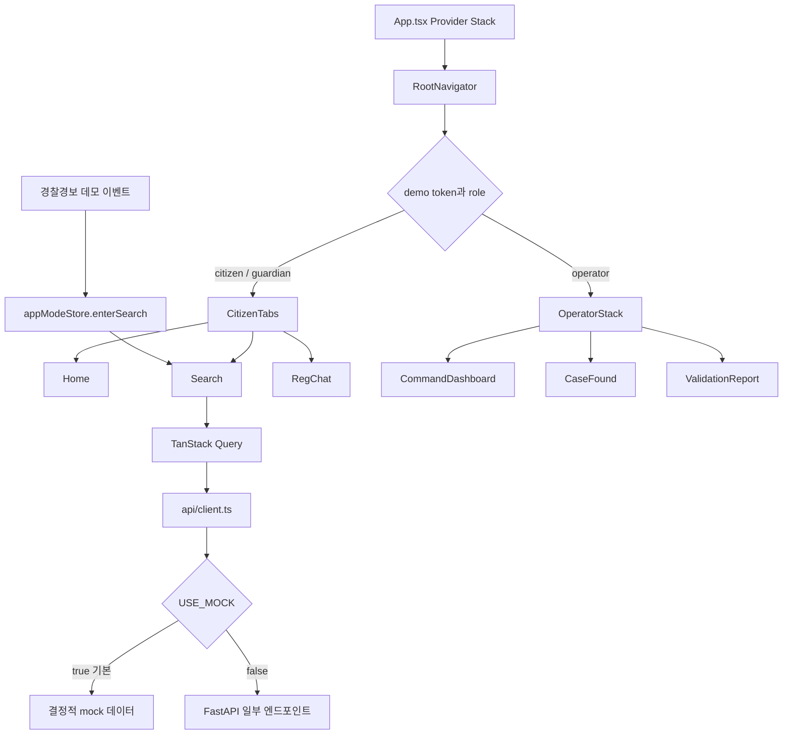

### 상태 관리

- `authStore`: 시민·보호자·운영자 데모 역할과 토큰을 관리한다.
- `appModeStore`: `walk/search`, 활성 Case, 심각도, 수색 진입 시각을 관리한다. 보호자 수동 실종 발동은 없다.
- `missingPersonStore`: 모든 화면이 김순자 데모 프로필 단일 소스를 참조한다.
- TanStack Query: POA, 경보, 검증·발견 요약 조회 경계를 제공한다.

### 실제 백엔드 연결 상태

| 기능 | 실모드 상태 |
|---|---|
| POA 조회 | 연결됨. 백엔드 H3 폴리곤을 받아 상대 확률 색상으로 변환 |
| POA 예측 실행 | 프런트가 자동 호출하지 않음. 서버 시드 또는 별도 호출 필요 |
| 타겟 알림 API | 호출됨. 반환값은 실제 전달 수로 매핑하지 않음 |
| 시민 제보 | 요청은 전송하지만 `with_photo`라는 계약 외 필드도 보내며 응답 매핑 후 항상 예외 |
| 보호자 온보딩 | 미연결. 로컬 스크립트만 사용 |
| 교차검증·검증 리포트·발견 요약 | 실모드에서도 목 빌더 반환 |
| 푸시·지오펜스 | 미구현 |

## 10. 개인정보 수명주기

개인정보 모듈은 Phase 0~3을 가로지르는 별도 정책 계층이다.

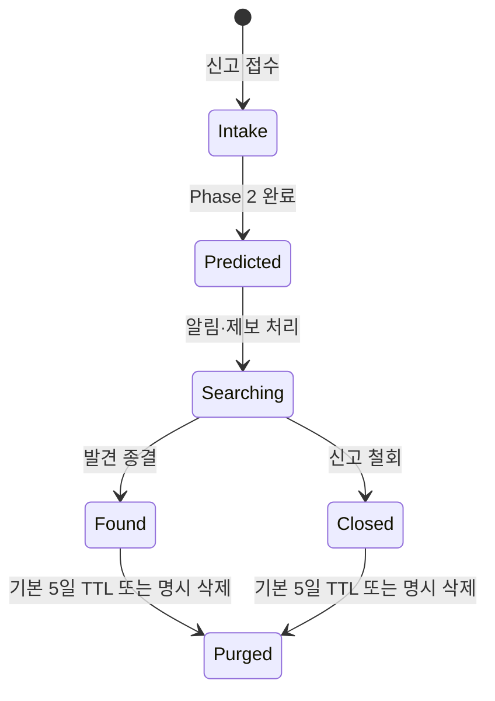

- 종결 전 케이스는 삭제할 수 없다.
- 종결 케이스는 예측·알림·제보를 받을 수 없다.
- 케이스 파기 시 내장 Report·Tip과 별도 debug trace를 함께 지운다.
- Persona 삭제 시 연결된 활성 Case가 있으면 거부하고, 종결 Case와 Interview를 연쇄 파기한다.
- Persona가 없는 미완료 Interview는 기본 48시간 뒤 파기 대상이다.
- 감사로그는 개인정보를 넣지 않고 ID·행위·사유 코드만 JSONL로 영속한다.
- TTL 파기는 운영 스케줄러가 아니라 현재 `POST /privacy/purge-expired` 수동 엔드포인트로 실행한다.

## 11. 모델·알고리즘 책임과 장애 폴백

| 구성요소 | 현재 담당 | 금지·비담당 | 실패·미설정 시 |
|---|---|---|---|
| Mi:dm | 온보딩 답변 추출, 질문 문장화, 제보 구조화 | 좌표·전역 경로, 다음 온보딩 슬롯 자율 선택 | 규칙 추출·씨앗 질문·키워드 휴리스틱 |
| EXAONE | prior, 선택적 축 채점, 경로 익숙함, 마음·목표 재해석 | 좌표·전역 경로, 미등록 목적지 생성 | 유형별 SAR prior·혼란 증가 휴리스틱 |
| Koester | 유형별 이동거리 확률 | 자연어 해석 | 항상 알고리즘 경로에 존재 |
| 6전략 MC | 확률적 이동과 종착점 분포 | 보호자 발화 해석 | 항상 실행 |
| OSMnx | 보행 도로망 제약 | 마음·목적 | 연속 공간 워커 |
| OSM·EGIS | 환경 거리·토지피복 | 목표 해석 | 환경 없는 도로망 MC 유지 |
| Kakao·Nominatim·Gazetteer | 장소 좌표화 | 경로 예측 | 다음 지오코더 또는 미해결 |
| VARCO·Upstage | Phase 1 어댑터 자리 | 핵심 실시간 예측 | 현재 결정적 스텁 |
| 푸시 인프라 | 아직 없음 | — | `sent=false` 스텁 응답 |

## 12. 설정 기본값 중 동작을 바꾸는 항목

| 환경 설정 | 기본값 | 효과 |
|---|---:|---|
| `AXIS_SCORING_ENABLED` | `false` | 축 점수와 route familiarity 컴파일 비활성 |
| `AXIS_SCORING_ASYNC` | `true` | Persona 확정 응답을 막지 않고 백그라운드 채점 |
| `USE_ROADNET` | `false` | 기본은 연속 공간 MC |
| `ROADNET_PRELOAD` | `false` | Phase 1에서 도로망 미리 받지 않음 |
| `MC_NUM_WALKERS` | `500` | Agent·Statistical 공통 워커 수 |
| `MIND_CALL_BUDGET` | `10` | 예측당 실제 EXAONE 마음 재해석 상한 |
| `REFLEX_ALERT_ON_INTAKE` | `true` | 신고 직후 안전반경 알림 경로 실행 |
| `REFLEX_KRING` | `2` | H3 중심 포함 19셀 |
| `ALERT_COVERAGE` | `0.8` | POA·D3 타겟 누적 커버리지 |
| `MAX_ALERT_CELLS` | `500` | 알림 폭주 방지 상한 |
| `TIP_DISCARD_THRESHOLD` | `0.2` | 제보 파기 기준 |
| `TIP_LKP_THRESHOLD` | `0.8` | 새 LKP 후보 기준 |
| `LAYER2_PERIODIC_MINUTES` | `45` | 주기 재실행 기준 |
| `KL_DIVERGENCE_THRESHOLD` | `0.5` | baseline 이탈 재실행 기준 |
| `JS_DIVERGENCE_THRESHOLD` | `0.05` | D3 예비 변화량 기준 |
| `NEW_REGION_MASS_THRESHOLD` | `0.05` | D3 새 셀 합산 질량 기준 |
| `PRIVACY_RETENTION_DAYS` | `5` | 종결 후 파기 TTL |
| `PRIVACY_SESSION_TTL_HOURS` | `48` | 고아 Interview 파기 TTL |

## 13. API 인벤토리

현재 FastAPI에는 루트·대시보드를 제외하고 24개 Phase·Privacy·Debug 엔드포인트가 있다.

| 그룹 | 엔드포인트 |
|---|---|
| Phase 0 | 인터뷰 시작·답변·조회, 슬롯 조회, Persona 등록·조회 6개 |
| Phase 1 | 신고 생성, Case 조회 2개 |
| Phase 2 | 예측 실행 1개 |
| Phase 3 | Reflex 알림, POA 알림, Tip, POA 조회, 재실행 확인 5개 |
| Privacy | 종결, 보존기간, Case 삭제, Persona 삭제, 만료 파기, 감사로그 6개 |
| Debug | traced predict, bundle, buildings, overview 4개 |

API 요청·응답의 상세 형식은 [`API_CONTRACT.md`](../API_CONTRACT.md)를 참고할 수 있으나, 이 파일에는 develop 최신 코드와 다른 설명이 남아 있다. 현재 동작의 최종 근거는 [`backend/app/api`](../backend/app/api)와 [`backend/app/schemas`](../backend/app/schemas)이다.

## 14. 테스트와 검증 자산

- `backend/tests`는 381개를 수집하며 379 passed / 2 skipped 이다(2건은 카카오 라이브 키 없는 실호출 지오코딩).
- E2E 흐름, D3, Phase 0 인터뷰, 축 채점, route familiarity, 도로망 MC, 인지 게이지, 제보 신뢰도, 개인정보 파기 등을 각각 테스트한다.
- 정릉동 도로망·환경·건물 fixture가 포함돼 있다.
- `backend/experiments/axis_goldset`에는 축 채점 골드셋 실험 스크립트와 결과가 있다.
- `/dashboard`와 Debug API는 워커 궤적, 마음 이벤트, EXAONE 입력·출력, 네 POA 레이어를 시각화한다.

테스트 개수는 2026-07-21 develop f1286f4 에서 pytest 를 직접 실행해 확인한 값이다.

## 15. develop 기준 구현·문서 불일치와 우선 정리 항목

### 문서·주석 불일치

**해소됨 (2026-07-21)**

- ~~`API_CONTRACT.md`가 route familiarity 컴파일러를 미구현으로 설명~~ → 갱신, `env_responses` 필드도 추가
- ~~`backend/README.md`가 OSMnx 도로망을 미구현으로 설명~~ → "구현됨, 운영 프로필·캐시 배포가 남음"으로 정정
- ~~스키마·축 기준표 주석의 route familiarity 미구현 표기~~ → `schemas/persona.py`·`phase0/axis_scoring.py`·`axis_rubric.md` 3곳 정정
- ~~PR #47 이후 E2E 대시보드에 남은 아동 문자열~~ → PR #49에서 제거

**남음**

1. `simulation.py` 문서 문자열은 Statistical MC를 "AI 없음"이라 표현하지만 실제 파이프라인은 동일 EXAONE prior를 전달한다. 정확히는 "동적 마음 재해석 제외 비교군"이다.

### 실서비스 전 핵심 미구현

1. 프런트 Phase 0 ↔ 백엔드 적응형 인터뷰 연결
2. 프런트 Phase 3 제보 ↔ 백엔드 응답·POA delta 매핑
3. 실제 multipart 사진·문서 업로드와 외부 추출 모델 연동 여부 정리
4. FCM/APNs, 셀 내 동의 사용자 위치 인덱스, 백그라운드 지오펜스
5. 인메모리 Repository의 영속 DB 전환
6. 주기 재실행·TTL 파기를 호출할 운영 스케줄러
7. `USE_ROADNET=true` 운영 프로필과 도로망·환경 캐시 배포
8. Statistical MC의 통계 전용 prior 분리 여부 결정
9. 게이지 계수·알림 임계·유형별 Koester 파라미터의 합성 시나리오 튜닝

## 16. 코드 탐색 지도

```text
Come-back-home/
├── backend/app/
│   ├── api/                 Phase·Privacy·Debug REST 라우터
│   ├── schemas/             Persona, Case, Prior, POA, Tip 도메인 모델
│   ├── phase0/              적응형 온보딩, 축 채점, 경로 익숙함 컴파일
│   ├── phase1/              신고 접수와 즉시 안전반경
│   ├── phase2/              prior, 가드레일, 게이지, MC, POA 결합
│   ├── phase3/              제보 신뢰도, 갱신, 재실행, 알림
│   ├── geo/                 H3, 지오코딩, POI, 도로망, 환경·도달가능성
│   ├── llm/                 Mi:dm, EXAONE, VARCO, Upstage 어댑터
│   ├── privacy/             종결·파기 수명주기
│   ├── static/dashboard.html
│   ├── config.py
│   ├── seed.py
│   └── storage.py
├── backend/tests/           381개 test 함수와 정릉동 fixture
├── frontend/src/
│   ├── api/                 목/실백엔드 전환 클라이언트
│   ├── navigation/          역할별 분리 트리
│   ├── store/               역할·앱모드·실종자 단일 소스
│   ├── screens/             시민·보호자·운영자 화면
│   └── components/          지도·POA·챗봇·상태 UI
├── API_CONTRACT.md
└── docs/IMPLEMENTATION_ARCHITECTURE.md
```
